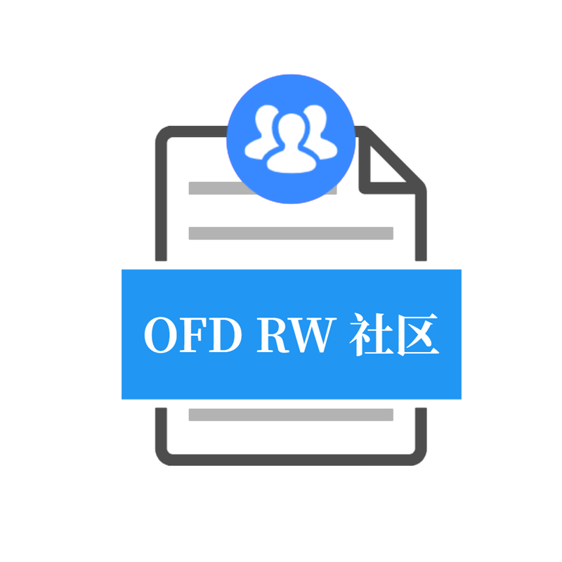

# OFD Reader & Writer 

  [](./LICENSE) 


在使用OFDRW前，请务必悉知 [***《OFD Reader & Writer免责声明》***](免责声明.md)！

> 若clone和文档预览存在困难，请移步 [https://gitee.com/ofdrw/ofdrw](https://gitee.com/ofdrw/ofdrw)

**Talk is cheap,Show me the code. ——Linus Torvalds**

<p align="center">
  
</p>

OFD Reader & Writer 开源的OFD处理库，支持文档生成、数字签名、文档保护、文档合并、转换等功能。

本项目采用Apache 2.0许可，请尊重开源项目作者，在软件中附带OFDRW开源软件许可。

根据[《GB/T 33190-2016 电子文件存储与交换格式版式文档》](./GBT_33190-2016_电子文件存储与交换格式版式文档.pdf)标准实现版式文档OFD库（含有书签）。

项目采用模块管理，各模块如下：

- [**ofdrw-core**](./ofdrw-core) OFD核心API，参考[《GB/T 33190-2016 电子文件存储与交换格式版式文档》](./GBT_33190-2016_电子文件存储与交换格式版式文档.pdf)实现的基础数据结构。
- [**ofdrw-font**](./ofdrw-font) 生成OFD字体相关。
- [**ofdrw-layout**](./ofdrw-layout) OFD布局引擎库，用于文档构建和渲染。
- [**ofdrw-pkg**](./ofdrw-pkg) OFD文件的容器，用于文档的打包。
- [**ofdrw-reader**](./ofdrw-reader) OFD文档解析器，用于OFD的反序列化以及签名签章。
- [**ofdrw-sign**](./ofdrw-sign) OFD文档数字签章。
- [**ofdrw-gm**](./ofdrw-gm) 用于支持签章模块需要的国密电子签章数据结构。
- [**ofrw-crypto**](./ofdrw-crypto) 用于实现《GM/T 0099-2020 开放版式文档密码应用技术规范》对OFD的密码相关功能。
- [**ofdrw-gv**](./ofdrw-gv) OFDRW 所有模块所共用的全局变量。
- [**ofdrw-converter**](./ofdrw-converter) OFD文档转换PDF、图片、SVG、HTML。
- [**ofdrw-tool**](./ofdrw-tool) OFD文档工具，文档合并、裁剪、重组。
- [**ofdrw-full**](./ofdrw-full) 上述所有模块整合包，用于简化依赖引入。

注：

- 您可以根据需求裁剪模块优化程序体积。
- 您可以仅引用`ofdrw-core`中定义的数据结来构建属于您自己的OFD库。

## QuickStart

引入依赖
```xml
<dependency>
  <groupId>org.ofdrw</groupId>
  <artifactId>ofdrw-full</artifactId>
  <version>1.20.1</version>
</dependency>
```

> OFDRW 将持续保证API的向下兼容，您可以放心的升级OFDRW库至最新版本。

如何生成一份OFD文档，如何把大象放入冰箱？


```java
public class HelloWorld {
    public static void main(String[] args) throws IOException {
        Path path = Paths.get("HelloWorld.ofd");
        try (OFDDoc ofdDoc = new OFDDoc(path)) {
            Paragraph p = new Paragraph("你好呀，OFD Reader&Writer！");
            ofdDoc.add(p);
        }
        System.out.println("生成文档位置: " + path.toAbsolutePath());
    }
}
```

效果如下：


- [生成示例](./ofdrw-layout/src/test/java/org/ofdrw/layout/OFDDocTest.java)
- [布局示例](./ofdrw-layout/src/test/java/org/ofdrw/layout/LayoutTest.java)
- [Canvas示例](./ofdrw-layout/src/test/java/org/ofdrw/layout/element/canvas/DrawContextTest.java)
- [文字抽取示例](./ofdrw-reader/src/test/java/org/ofdrw/reader/ContentExtractorTest.java)
- [水印示例](./ofdrw-layout/src/test/java/org/ofdrw/layout/cases/watermark/WatermarkTest.java)
- [段落布局示例](./ofdrw-layout/src/test/java/org/ofdrw/layout/ParagraphLayoutDemo.java)
- [数字签名清理示例](./ofdrw-sign/src/test/java/org/ofdrw/sign/SignCleanerTest.java)
- [文档编辑示例](./ofdrw-layout/src/test/java/org/ofdrw/layout/DocEditDemos.java)

相关文档目录：

- [OFD R&W 布局设计](./ofdrw-layout/doc/README.md)
- [OFD R&W Canvas](./ofdrw-layout/doc/canvas/README.md)
- [OFD R&W 签名签章快速入门](./ofdrw-sign/doc/quickstart/README.md)
- [OFD R&W 加密 完整性保护协议](./ofdrw-crypto/README.md)
- [OFD R&W OFD转换PDF](./ofdrw-converter/README.md)
- [OFD R&W OFD转换图片](./ofdrw-converter/README.md)
- [OFD R&W OFD转换SVG](./ofdrw-converter/README.md)
- [OFD R&W OFD转换HTML](./ofdrw-converter/README.md)
- [OFD R&W 字形数据解析](./ofdrw-converter/src/main/java/org/ofdrw/converter/font/README.md)
- [OFD R&W 文档合并](./ofdrw-tool/README.md)


OFD阅读器客户端: [数科阅读器 . http://www.suwell.cn/](http://www.suwell.cn/)

### 社区解决方案

#### HTML5

HTML5前端预览解决方案： [DLTech21/ofd.js . https://github.com/DLTech21/ofd.js](https://github.com/DLTech21/ofd.js)

- `jszip`解压。
- `fast-xml-parser`解析xml为json数据。
- `svg`及`canvas`渲染实现。
- 完全浏览器OFD页面渲染。

#### 开源客户端

推荐开源客户端预览解决方案： [roy19831015/OfdiumEx . https://github.com/roy19831015/OfdiumEx](https://github.com/roy19831015/OfdiumEx)

- 基于cairo库渲染OFD。
- Windows客户端

#### OFD R&W Android

OFD Reader and Writer 安卓平台解决方案： [DLTech21/ofdrw-aar . https://github.com/DLTech21/ofdrw-aar](https://github.com/DLTech21/ofdrw-aar)

#### 图片转换

> 目前已经被合并到`ofdrw-converter` 模块

推荐开源OFD图片转换解决方案： [QAQtutu/ofdbox . https://github.com/QAQtutu/ofdbox](https://github.com/QAQtutu/ofdbox)

- 支持OFD解析。
- 基于java.awt解析OFD实现图片绘制。

## 源码安装


> 支持 ***JDK 1.8*** 及以上版本构建。

在项目根目录下运行：

```bash
mvn install
```

就可以完成项目的构建打包，安装到本地Maven仓库中。

## 社区交流

***Share and Communicate***

<p align="center">
  
</p>
为方便社区建设与交流，提供社区QQ群： 

- 04群号： **690642037** *（新）*
- 03群号： **717320255** *（满）*
- 02群号： **745517934** *（满）*
- 01群号： **577682453** *（满）*

<p align="center">
  
</p>


> - 若您遇到与OFD相关的技术问题，欢迎进群交流!
> - 若您对项目有建设性意见或方案欢迎提交**Issue**与**PR**。

## 参与贡献

参与贡献代码尽量遵守下面代码规约：

1. **原则上禁止`public`方法、类、接口进行删除**：为了保留向下兼容性，如果是更新升级请标注过去已经暴露方法、接口、类为过时标记`@Deprecated`，并注释置新的实现位置`@deprecated {@link SomethingNew}`。
2. **请为每个`public`方法、类、接口添加注释**：为了保留开发者的便利性，注释一般为多行注释，注释内容需要包含参数以及方法或类的作用、参数意义、返还值以及意义、异常抛出、以及参数意义。

[>> GitHub 第一次参与开源(多语言)](https://github.com/firstcontributions/first-contributions)

> - [贡献指南](CONTRIBUTING.md)。

## 项目情况

### 进展

[>> 项目进展](releasenotes.md)

### 项目关注度

> 项目获得 Star曲线

[](https://starchart.cc/ofdrw/ofdrw)
