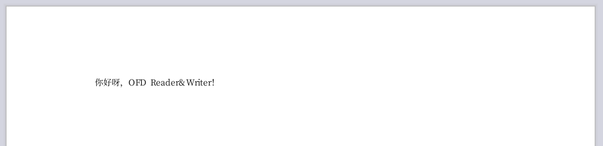

# OFD Reader & Writer

 [](./LICENSE)


在使用OFDRW前请务必悉知 [***《OFD Reader & Writer免责声明》***](免责声明.md)。


> 如何clone和预览存在困难，请移步 [https://gitee.com/Trisia/ofdrw](https://gitee.com/Trisia/ofdrw)


**Talk is cheap,Show me the code. ——Linus Torvalds**

**像写HTML和Word那样简单的编写OFD。**

根据[《GB/T 33190-2016 电子文件存储与交换格式版式文档》](./GBT_33190-2016_电子文件存储与交换格式版式文档.pdf)标准实现版式文档OFD库（含有书签）。

项目结构：

- [**ofdrw-core**](./ofdrw-core) OFD核心API，参考[《GB/T 33190-2016 电子文件存储与交换格式版式文档》](./GBT_33190-2016_电子文件存储与交换格式版式文档.pdf)实现的基础数据结构。
- [**ofdrw-font**](./ofdrw-font) 生成OFD字体相关。
- [**ofdrw-layout**](./ofdrw-layout) OFD布局引擎库，用于文档构建和渲染。
- [**ofdrw-pkg**](./ofdrw-pkg) OFD文件的容器，用于文档的打包。
- [**ofdrw-reader**](./ofdrw-reader) OFD文档解析器，用于OFD的反序列化以及签名签章。
- [**ofdrw-sign**](./ofdrw-sign) OFD文档数字签章。
- [**ofdrw-gm**](./ofdrw-gm) 用于支持签章模块需要的国密电子签章数据结构。
- [**ofdrw-gv**](./ofdrw-gv) OFDRW 所有模块所共用的全局变量。
- [**ofdrw-converter**](./ofdrw-converter) OFD文档转换PDF。***New***
- [**ofdrw-full**](./ofdrw-full) 上述所有模块整合包，用于简化依赖引入。

## QuickStart

引入依赖
```xml
<dependency>
  <groupId>org.ofdrw</groupId>
  <artifactId>ofdrw-full</artifactId>
  <version>1.7.3</version>
</dependency>
```

如何生成一份OFD文档？

> 如何把大象放入冰箱。

```java
public class HelloWorld {
    public static void main(String[] args) throws IOException {
        Path path = Paths.get("HelloWorld.ofd");
        try (OFDDoc ofdDoc = new OFDDoc(path)) {
            Paragraph p = new Paragraph("你好呀，OFD Reader&Writer！");
            ofdDoc.add(p);
        }
        System.out.println("生成文档位置: " + path.toAbsolutePath());
    }
}
```

效果如下：



- [生成示例](./ofdrw-layout/src/test/java/org/ofdrw/layout/OFDDocTest.java)
- [布局示例](./ofdrw-layout/src/test/java/org/ofdrw/layout/LayoutTest.java)
- [Canvas示例](./ofdrw-layout/src/test/java/org/ofdrw/layout/element/canvas/DrawContextTest.java)
- [文字抽取示例](./ofdrw-reader/src/test/java/org/ofdrw/reader/ContentExtractorTest.java)
- [水印示例](./ofdrw-layout/src/test/java/org/ofdrw/layout/cases/watermark/WatermarkTest.java)
- [段落示例](./ofdrw-layout/src/test/java/org/ofdrw/layout/cases/content/ParagraphCase.java)

相关文档目录：

- [OFD R&W 布局设计](./ofdrw-layout/doc/README.md)
- [OFD R&W Canvas](./ofdrw-layout/doc/canvas/README.md)
- [OFD R&W 签名签章快速入门](./ofdrw-sign/doc/quickstart/README.md)
- [OFD R&W OFD转换PDF](./ofdrw-converter/README.md)

OFD阅读器客户端: [数科阅读器 . http://www.suwell.cn/](http://www.suwell.cn/)

### 推荐解决方案

#### HTML预览

**DLTech21/ofd.js**


推荐开源的OFD在线预览解决方案： [DLTech21/ofd.js . https://github.com/DLTech21/ofd.js](https://github.com/DLTech21/ofd.js)

- 将OFD渲染为SVG实现矢量的无失真的OFD预览体验。
- 完全基于浏览器在前端完成所有渲染工作，不需要服务端支持和插件。

#### 图片转换

推荐开源OFD图片转换解决方案： [QAQtutu/ofdbox . https://github.com/QAQtutu/ofdbox](https://github.com/QAQtutu/ofdbox)

- 支持OFD解析。
- 基于java.awt解析OFD实现图片绘制。

## 源码安装

在项目根目录下运行

```bash
mvn install
```

就可以完成项目的构建打包，安装到本地Maven仓库中。

## 交流

***Share and Communicate***

为了方便大家的交流提供QQ群

> - 01群号： **577682453** *（满）*
> - 02群号： **745517934**


如果各位对 OFD R&W 有 **问题** 或是 **建议** 可以提交issue和PullRequest，欢迎进群交流。

## 参与贡献

[>> GitHub 第一次参与开源(多语言)](https://github.com/firstcontributions/first-contributions)

> [贡献指南](CONTRIBUTING.md)。

## 项目情况

### 进展

[>> 项目进展](releasenotes.md)

### 项目关注度

> 项目获得 Star曲线

[](https://starchart.cc/Trisia/ofdrw)
