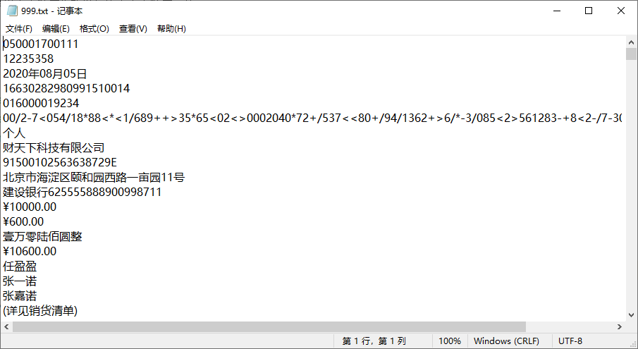

# OFDRW 文档导出

OFD Reader & Writer Document Exporter (OFDRW DE)

OFDRW提供了将OFD文档导出为其他格式文档的能力，如导出为图片、SVG、文本等。

> 致谢：该模块的发展离不开社区的支持，非常感谢 [DLTech21](https://github.com/DLTech21)、 [QAQtutu](https://github.com/QAQtutu)、[yuanfangme](https://github.com/yuanfangme)
等人的贡献。

## 入门

使用Maven 引入相关模块

```xml
<dependency>
    <groupId>org.ofdrw</groupId>
    <artifactId>ofdrw-converter</artifactId>
    <version>2.3.2</version>
</dependency>
```

> - 若您没有采用Maven管理项目，请参阅项目中`pom.xml`文件中的依赖，手动解决三方依赖包问题。


OFDRW 转换模块在`2.0.0`之后抽象了多种文档导出接口，使用统一的API实现OFD文档导出功能。

在开始文档转换之前您可以需要花几分钟，学习一下`OFDExporter`如何使用。

`org.ofdrw.converter.export.OFDExporter`为OFD文档导出器接口，其关键方法`export`方法签名如下所示：

```
void export(int...indexes)throws GeneralConvertException
```

**注意：`export`方法的参数页码均从0起，例如文档中的第1页的Index也就是0。**

`OFDExporter`使用方式如下：

1. 新建一个目标对象的导出对象。
2. 调用导出方法导出OFD文档的某几页或整个导出。
3. 关闭导出对象。

API调用形式如下：

```
OFDExporter exporter = new ImageExporter(ofdPath, targetPath)
exporter.export();
exporter.close();
```

`OFDExporter`接口中的`export`接口支持传入多个可变参数的页码，并且支持多次调用，通过灵活的调整参数可以实现意想不到的页面组装效果，若在调用时不传任何参数则表示全文导出，下面给出几种示例。

从OFD中导出全部页面：

```
OFDExporter exporter = new HTMLExporter(ofdPath, htmlPath);
exporter.export();
exporter.close();
```

从OFD中导出指定页码，导出第1、3、5页：

```
OFDExporter exporter = new HTMLExporter(ofdPath, htmlPath);
exporter.export(0, 2, 4);
exporter.close();
```

从OFD中导出指定页码，并对导出的文档页序进行重组，例如导出1、2、3页，导出的文档中页序原来文档的3、1、2页：

```
OFDExporter exporter = new HTMLExporter(ofdPath, htmlPath);
exporter.export(2, 0, 1);
exporter.close();
```

从OFD中导出指定页码，前几页或后几页，例如一份文档总计5页，现需要导出第1、2、5页，除了上述可变参数的方式导出还可以使用多次调用的方式实现：

```
OFDExporter exporter = new HTMLExporter(ofdPath, htmlPath);
exporter.export(0);
exporter.export(1);
exporter.export(4);
exporter.close();
```

可以重复导出某一页来实现重复页面的效果，例如导出第1页然后重复导出2页第3页：

```
OFDExporter exporter = new HTMLExporter(ofdPath, htmlPath);
exporter.export(0, 2);
exporter.export(2);
exporter.close();
```

在某些情况您可能需要通过指定导出指定范围的页面，这时可以使用数组的方式构造页码，例如OFD文档总计10页，导出3-6页、9-10页：

```
int[] range1 = new int[]{3, 4, 5, 6};
int[] range2 = new int[]{8, 9};

OFDExporter exporter = new HTMLExporter(ofdPath, htmlPath);
exporter.export(range1);
exporter.export(range2);
exporter.close();
```

若数组`null`或长度为0同样表示导出全部页面。

## OFD文档导出

若您尚未阅读 **入门** 章节，请先阅读上述章节再继续学习。

`OFDExporter`接口具有多个实现，其实现与导出的目的文档有关。

接口实现类命名格式为： ***目标格式+Exporter***

例如：`ImageExporter`表示OFD的导出目标格式为图片，`PDFExporter`表示导出格式为PDF。

目前OFDExporter支持导出为以下类型：

- 图片：`ImageExporter`
- SVG矢量图形：`SVGExporter`
- PDF文档：`PDFExporterIText`、`PDFExporterPDFBox`
- HTML网页：`HTMLExporter`
- 纯文本：`TextExporter`

不同的导出实现结合目标类型特性具有不同的接口，下面将介绍各种导出器的使用方式，以及特有方法。

### 导出为图片

导出OFD文档页面为图片，图片格式支持PNG、BPM、JPG。

实现类：`org.ofdrw.converter.export.ImageExporter`

注意事项：

- 可以通过构造器指定导出的图片类型，目前支持`PNG`、`JPG`、`BPM`，默认为`PNG`格式。
- 可以通过构造器或方法设置导出图片的质量，也就是`ppm`参数，默认`ppm`为**15**。
- 导出图片将存放于同一个目录，在该目录中图片以的页面索引作为文件名，如第1页的文件名为`0.png`。

示例：

```
Path ofdPath = Paths.get("src/test/resources/999.ofd");
Path imgDirPath = Paths.get("target/999.ofd/");
try (ImageExporter exporter = new ImageExporter(ofdPath, imgDirPath, "PNG", 20d)) {
    exporter.export();
}
```

效果如下：


| 特有方法                           | 用途                               |
|:-------------------------------|:---------------------------------|
| `List<Path> getImgFilePaths()` | 获取导出页面对应图片文件路径，列表中次序与导出时的页码次序一致。 |
| `void setPPM(double ppm)`      | 设置导出图片质量，单位为：每毫米像素数量。            |

> 详见 [测试用例](../src/test/java/org/ofdrw/converter/export/ImageExporterTest.java)

### 导出为SVG图形

导出OFD文档页面为SVG图形，文本中的所有文字都将转换为矢量路径。

实现类：`org.ofdrw.converter.export.SVGExporter`

注意事项：

- 可以通过构造器或方法设置导出SVG图形大小，也就是`ppm`参数，默认`ppm`为**15**。
- 导出SVG图形文件将存放于同一个目录，在该目录中以页面索引作为文件名，如第1页的文件名为`0.svg`。

示例：

```
Path ofdPath = Paths.get("src/test/resources/999.ofd");
Path svgPath = Paths.get("target/999.ofd/");
try (SVGExporter exporter = new SVGExporter(ofdPath, svgPath, 15d)) {
    exporter.export();
}
```

效果如下：


| 特有方法                           | 用途                                |
|:-------------------------------|:----------------------------------|
| `List<Path> getSvgFilePaths()` | 获取导出页面对应SVG文件路径，列表中次序与导出时的页码次序一致。 |
| `void setPPM(double ppm)`      | 设置导出SVG大小，单位为：每毫米像素数量。            |

> 详见 [测试用例](../src/test/java/org/ofdrw/converter/export/SVGExporterTest.java)

### 导出为HTML网页

导出OFD文档页面为HTML网页，需要浏览器支持HTML5才可正常预览，由于是基于SVG方案导出的HTML，因此导出文件可能较大。

实现类：`org.ofdrw.converter.export.HTMLExporter`

注意事项：

- 若您需要调整HTML网页样式，可以通过继承`HTMLExporter`并覆盖`header`、`booter`、`margin_bottom`属性，使用自定义的HTML样式。
- 导出的HTML网页需要浏览器支持HTML5才可正常预览。
- 若页面文字内容由文字图元构成且都由Unicode组成，那么导出网页可能可以通过鼠标选中与复制。

示例：

```
Path ofdPath = Paths.get("src/test/resources/n.ofd");
Path htmlPath = Paths.get("target/n.html");
try (HTMLExporter exporter = new HTMLExporter(ofdPath, htmlPath)) {
    exporter.export();
}
```

效果如下：


> 详见 [测试用例](../src/test/java/org/ofdrw/converter/export/HTMLExporterTest.java)


### 导出为文本

导出OFD文档页面为文本文件，并非所有OFD页面都能导出文本，只有符合特定条件的OFD才可导出。

实现类：`org.ofdrw.converter.export.TextExporter`

注意事项：

- 部分OFD文档由于采用字形索引来定位文字、有个OFD整个页面均为路径数据图元而不是文字图元、有的OFD页面整个都为图片等诸多原因，无法保证一定能够导出文本。
- 由于文本布局等各种因素，导出文本顺序也难以与原文文本顺序一致。

示例：

```
Path ofdPath = Paths.get("src/test/resources/999.ofd");
Path txtPath = Paths.get("target/999.txt");
try (TextExporter exporter = new TextExporter(ofdPath, txtPath)) {
    exporter.export();
}
```

效果如下：



> 详见 [测试用例](../src/test/java/org/ofdrw/converter/export/TextExporterTest.java)


### [不推荐] 导出为PDF

**警告：不推荐导出为PDF，OFD本身就是国产的板式文件，非特殊场景没有必要导出为PDF文件，该模块将进入LTS状态，不再持续更新！**

导出OFD文档页面为PDF文件，该导出根据实现所使用的库不一致具有两种导出实现。

实现类：

- `org.ofdrw.converter.export.PDFExporterIText`
- `org.ofdrw.converter.export.PDFExporterPDFBox`

注意事项：

- 导出无法保证文档效果一致性，若您有建设性意见请提交PR。

基于PDFBox实现示例：

```
Path ofdPath = Paths.get("src/test/resources/999.ofd");
Path pdfPath = Paths.get("target/999.pdf");
try (OFDExporter exporter = new PDFExporterPDFBox(ofdPath, pdfPath)) {
    exporter.export();
}
```

> 详见 [基于PDFBox导出 测试用例](../src/test/java/org/ofdrw/converter/export/PDFExporterPDFBoxTest.java)


基于iText实现示例：

```
Path ofdPath = Paths.get("src/test/resources/999.ofd");
Path pdfPath = Paths.get("target/999.pdf");
try (OFDExporter exporter = new PDFExporterIText(ofdPath, pdfPath)) {
    exporter.export();
}
```

> 详见 [基于iText导出 测试用例](../src/test/java/org/ofdrw/converter/export/PDFExporterITextTest.java)


效果如下：

