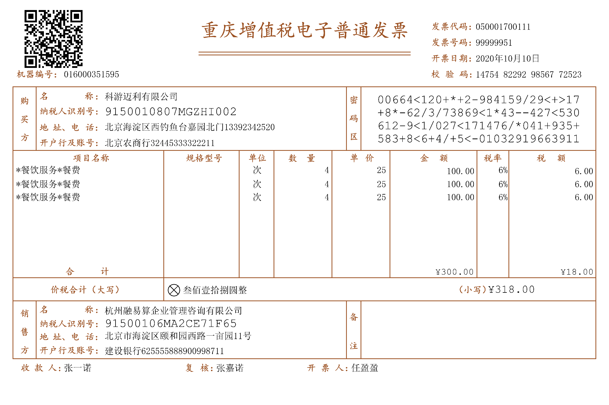
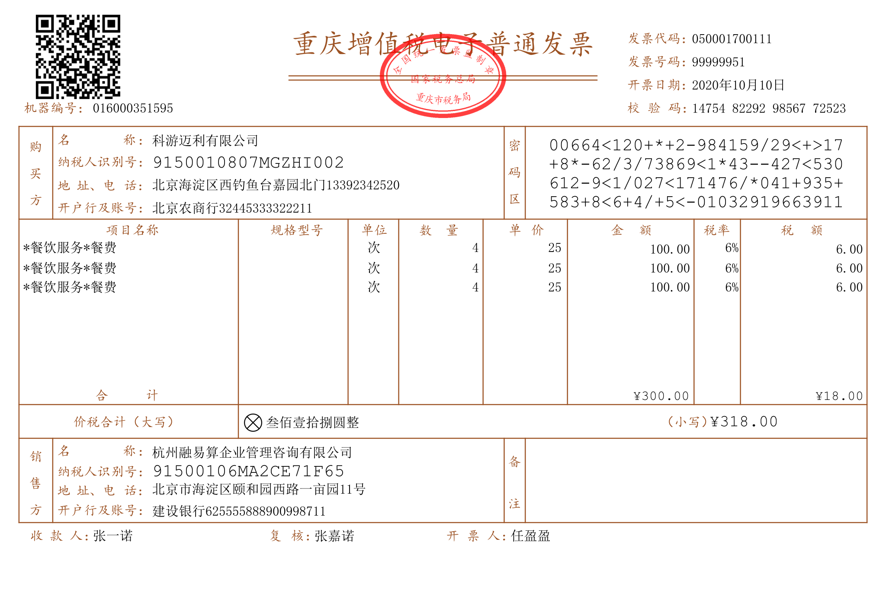
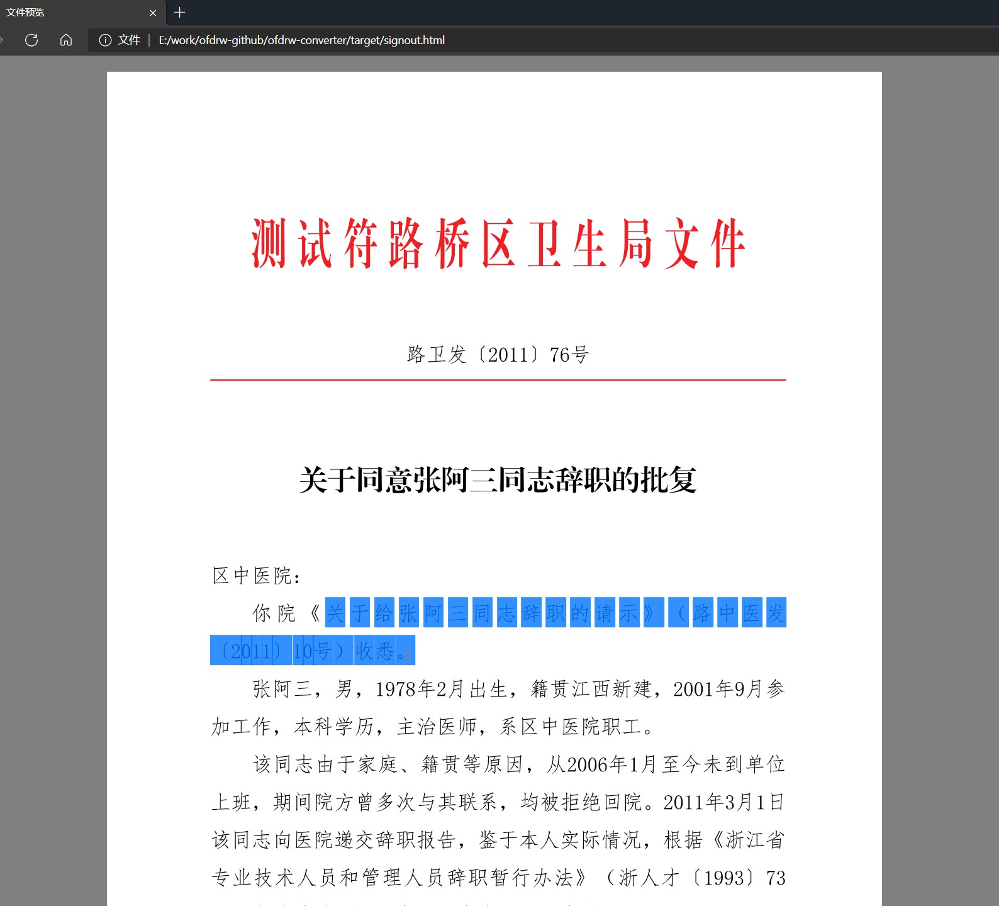
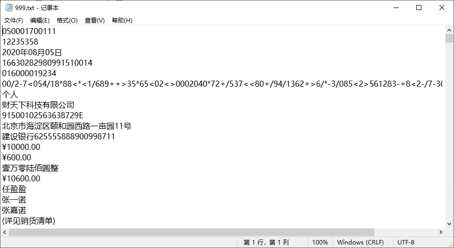
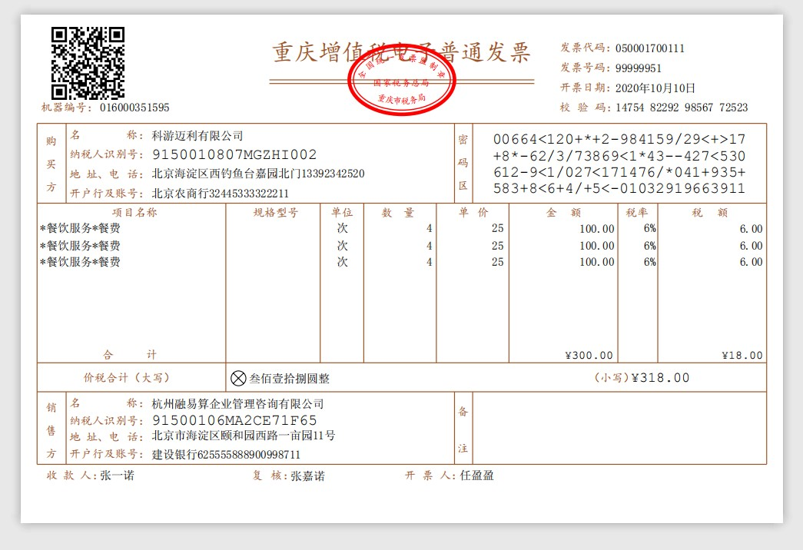

# OFDRW 文档导出

OFD Reader & Writer Document Exporter (OFDRW DE)

> **提示**：导出为 PDF/图片/文本属有损转换，不作为查看手段。预览请用 [ofdrw-viewer](https://github.com/ofdrw/ofdrw-viewer)；仅需图片优先用其 CLI。详见本模块 [README](../README.md)。

OFDRW提供了将OFD文档导出为其他格式文档的能力，如导出为图片、SVG、文本等。

> 致谢：该模块的发展离不开社区的支持，非常感谢 [DLTech21](https://github.com/DLTech21)、 [QAQtutu](https://github.com/QAQtutu)、[yuanfangme](https://github.com/yuanfangme)
等人的贡献。

## 入门

使用Maven 引入相关模块

```xml
<dependency>
    <groupId>org.ofdrw</groupId>
    <artifactId>ofdrw-converter</artifactId>
    <version>2.5.0</version>
</dependency>
```

> - 若您没有采用Maven管理项目，请参阅项目中`pom.xml`文件中的依赖，手动解决三方依赖包问题。


OFDRW 转换模块在`2.0.0`之后抽象了多种文档导出接口，使用统一的API实现OFD文档导出功能。

在开始文档转换之前您可以需要花几分钟，学习一下`OFDExporter`如何使用。

`org.ofdrw.converter.export.OFDExporter`为OFD文档导出器接口，其关键方法`export`方法签名如下所示：

```
void export(int...indexes)throws GeneralConvertException
```

**注意：`export`方法的参数页码均从0起，例如文档中的第1页的Index也就是0。**

`OFDExporter`使用方式如下：

1. 新建一个目标对象的导出对象。
2. 调用导出方法导出OFD文档的某几页或整个导出。
3. 关闭导出对象。

API调用形式如下：

```
OFDExporter exporter = new CanvasImageExporter(ofdPath, targetPath);
exporter.export();
exporter.close();
```

`OFDExporter`接口中的`export`接口支持传入多个可变参数的页码，并且支持多次调用，通过灵活的调整参数可以实现意想不到的页面组装效果，若在调用时不传任何参数则表示全文导出，下面给出几种示例。

从OFD中导出全部页面：

```
OFDExporter exporter = new HTMLExporter(ofdPath, htmlPath);
exporter.export();
exporter.close();
```

从OFD中导出指定页码，导出第1、3、5页：

```
OFDExporter exporter = new HTMLExporter(ofdPath, htmlPath);
exporter.export(0, 2, 4);
exporter.close();
```

从OFD中导出指定页码，并对导出的文档页序进行重组，例如导出1、2、3页，导出的文档中页序原来文档的3、1、2页：

```
OFDExporter exporter = new HTMLExporter(ofdPath, htmlPath);
exporter.export(2, 0, 1);
exporter.close();
```

从OFD中导出指定页码，前几页或后几页，例如一份文档总计5页，现需要导出第1、2、5页，除了上述可变参数的方式导出还可以使用多次调用的方式实现：

```
OFDExporter exporter = new HTMLExporter(ofdPath, htmlPath);
exporter.export(0);
exporter.export(1);
exporter.export(4);
exporter.close();
```

可以重复导出某一页来实现重复页面的效果，例如导出第1页然后重复导出2页第3页：

```
OFDExporter exporter = new HTMLExporter(ofdPath, htmlPath);
exporter.export(0, 2);
exporter.export(2);
exporter.close();
```

在某些情况您可能需要通过指定导出指定范围的页面，这时可以使用数组的方式构造页码，例如OFD文档总计10页，导出3-6页、9-10页：

```
int[] range1 = new int[]{3, 4, 5, 6};
int[] range2 = new int[]{8, 9};

OFDExporter exporter = new HTMLExporter(ofdPath, htmlPath);
exporter.export(range1);
exporter.export(range2);
exporter.close();
```

若数组`null`或长度为0同样表示导出全部页面。

## OFD文档导出

若您尚未阅读 **入门** 章节，请先阅读上述章节再继续学习。

`OFDExporter`接口具有多个实现，其实现与导出的目的文档有关。

接口实现类命名格式为： ***目标格式+Exporter***

例如：`CanvasImageExporter`表示OFD的导出目标格式为图片，`PDFExporter`表示导出格式为PDF。

目前OFDExporter支持导出为以下类型：

- 图片：`CanvasImageExporter`（`ImageExporter` 已废弃，见下节“从 ImageExporter 迁移”）
- SVG矢量图形：`SVGExporter`
- PDF文档：`PDFExporter`
- HTML网页：`HTMLExporter`
- 纯文本：`TextExporter`

不同的导出实现结合目标类型特性具有不同的接口，下面将介绍各种导出器的使用方式，以及特有方法。

### 导出为图片

导出OFD文档页面为图片，图片格式支持PNG、JPG、BMP。

实现类：`org.ofdrw.converter.export.CanvasImageExporter`

> `org.ofdrw.converter.export.ImageExporter` 已标记 `@Deprecated`，仅为兼容 2.4.x 调用方保留，新代码请使用 `CanvasImageExporter`。

#### 构造器

`CanvasImageExporter` 提供 5 个构造器：

| 构造器 | 说明 |
|:---|:---|
| `CanvasImageExporter(Path ofdFile, Path outDir)` | 默认 `PNG` 格式、默认 `ppm`（15） |
| `CanvasImageExporter(InputStream ofdInput, Path outDir)` | 来源为输入流，默认 `PNG` 格式、默认 `ppm`；该流由调用者负责关闭 |
| `CanvasImageExporter(Path ofdFile, Path outDir, String imageFormat, double ppm)` | 指定格式与 `ppm` |
| `CanvasImageExporter(InputStream ofdInput, Path outDir, String imageFormat, double ppm)` | 来源为输入流，指定格式与 `ppm`；该流由调用者负责关闭 |
| `CanvasImageExporter(OFDReader reader, Path outDir, String imageFormat, double ppm)` | 复用外部 `OFDReader`；**外部传入的 `OFDReader` 由调用方负责关闭，`close()` 不会关闭它** |

构造器参数：

| 参数 | 说明 |
|:---|:---|
| `ofdFile` / `ofdInput` | 待导出的 OFD 文档 |
| `reader` | 外部 OFD 解析器，用于多页批量导出时复用页面缓存 |
| `outDir` | 图片输出目录，不存在时自动创建；若已存在同名普通文件则抛 `IllegalArgumentException` |
| `imageFormat` | 输出格式，支持 `PNG`、`JPG`（别名 `JPEG`）、`BMP`，大小写不敏感 |
| `ppm` | 每毫米像素数量，不大于 0 时使用默认值 15 |

#### 参数设置

所有参数设置方法都应在调用 `export` **之前**完成。

| 方法 | 用途 | 默认值 / 规则 |
|:---|:---|:---|
| `void setPPM(double ppm)` | 设置每毫米像素数量 | 默认 `15`；不大于 0 时忽略该设置并告警 |
| `void setImageFormat(String imageFormat)` | 设置输出格式 | 默认 `PNG`；支持 `PNG` / `JPG`（`JPEG`）/ `BMP`；其他值抛 `IllegalArgumentException` |
| `void setJpegQuality(float quality)` | 设置 JPG 压缩质量 | 默认 `0.92`；取值 `0.0`–`1.0`，越界自动修正并告警；**仅 JPG 生效**，PNG/BMP 忽略 |
| `void setBackground(Color background)` | 设置背景色 | 默认白色（`Color.WHITE`）；传 `null` 表示透明背景，**仅 PNG 有效**，JPG/BMP 下 `null` 按白色处理 |
| `void setRotation(int degree)` | 设置顺时针旋转角度 | 默认 `0`；仅接受 `0`、`90`、`180`、`270`（`-90` 归一化为 `270`），其余值忽略并告警 |
| `void setMaxPixels(long maxPixels)` | 设置单页像素上限 | 默认 `64000000`（6400 万像素）；小于等于 0 表示不限制 |
| `void setFilenamePattern(String pattern)` | 设置文件名模式，`String.format` 语义 | 默认 `page-%d`；必须恰好包含一个整型占位符（如 `%d`、`%03d`），不能含路径分隔符，否则抛 `IllegalArgumentException` |
| `void setFilenameIndexBase(IndexBase base)` | 设置占位符取值基准 | 默认 `IndexBase.PAGE`（代入页码）；`IndexBase.SEQUENCE` 表示代入本次导出的序号 |

图片文件扩展名由格式决定：`PNG` → `.png`，`JPG` → `.jpg`，`BMP` → `.bmp`。

#### 结果获取

| 方法 | 用途 |
|:---|:---|
| `List<Path> getImgFilePaths()` | 获取已导出图片的文件路径，次序与导出时的页码次序一致 |
| `List<ImageInfo> getImageInfos()` | 获取最近一次导出的图片尺寸与导出参数快照（页码、宽、高、旋转角度、`ppm`、路径） |

#### 示例

导出全部页面为 PNG，默认按页码命名（`page-0.png`、`page-1.png`…）：

```java
Path ofdPath = Paths.get("src/test/resources/999.ofd");
Path imgDirPath = Paths.get("target/999.ofd/");
try (CanvasImageExporter exporter = new CanvasImageExporter(ofdPath, imgDirPath)) {
    exporter.export();
    for (Path img : exporter.getImgFilePaths()) {
        System.out.println(img);
    }
}
```

导出指定页面为 JPG，设置质量与顺时针旋转 90 度：

```java
Path ofdPath = Paths.get("src/test/resources/999.ofd");
Path imgDirPath = Paths.get("target/999.jpg/");
try (CanvasImageExporter exporter = new CanvasImageExporter(ofdPath, imgDirPath, "JPG", 15d)) {
    exporter.setJpegQuality(0.92f);
    exporter.setRotation(90);
    // 仅导出第 1、3 页（页码从 0 起）
    exporter.export(0, 2);
}
```

复用外部 `OFDReader`（Reader 由调用方关闭），导出透明背景 PNG：

```java
Path ofdPath = Paths.get("src/test/resources/999.ofd");
Path imgDirPath = Paths.get("target/999.alpha/");
try (OFDReader reader = new OFDReader(ofdPath);
     CanvasImageExporter exporter = new CanvasImageExporter(reader, imgDirPath, "PNG", 15d)) {
    // 透明背景仅对 PNG 生效
    exporter.setBackground(null);
    exporter.export(0);
}
```

效果如下：



#### 行为说明

- **页码从 0 起**：`export(int... indexes)` 的页码与文档页码对应，越界页码会被跳过并告警；不传参数表示导出全部页面；页码可以乱序或重复。
- **像素尺寸向上取整**：页面像素宽高按 `Math.ceil(ppm × 毫米尺寸)` 计算，避免高分辨率下右侧、底部被裁掉 1 像素。旋转 90/270 时输出宽高互换，像素上限按旋转后的输出尺寸校验。
- **像素上限**：单页输出像素数超过 `maxPixels` 时抛 `GeneralConvertException`，异常信息包含请求尺寸、像素数与上限值。可用 `setPPM` 降低分辨率或 `setMaxPixels` 调整上限。
- **旋转实现**：先把整页按未旋转方向渲染到离屏画布，再对整幅位图做像素级顺时针旋转。之所以不在画布上预先施加旋转，是因为 `AWTMaker` 在绘制各类元素时会无条件调用 `Graphics2D.setTransform` 重置画布变换，若预先旋转，只有位图类元素会跟随旋转，矢量文字与图形不会旋转，产生“部分旋转”的错误图像。
- **背景与透明**：`setBackground(null)` 时画布保持全透明（仅 PNG 能保留 alpha 通道）；JPG、BMP 不支持透明，编码前会合成到白色（或指定背景色）上，避免透明像素变成黑块。
- **物理分辨率元数据**：编码通过 `ImageWriter` 完成，以便同时设置 JPG 压缩质量与物理分辨率。JPEG 写入 JFIF 像素密度（`dpi = ppm × 25.4`，取整），PNG 写入 `pHYs` 物理像素尺寸（每米像素数 = `round(1 / (ppm × 0.001))`，等价于 `round(1000 / ppm)`）。元数据写入失败时降级为无元数据输出并告警，不中断导出；BMP 不写入分辨率元数据。
- **资源释放**：每页画布与编码用位图在导出后立即 `flush()`，连续导出大量页面时像素内存不会无限堆积。
- **异常**：调用 `close()` 后再调用 `export` 抛 `GeneralConvertException("导出器已关闭")`；编码或写文件失败抛 `GeneralConvertException` 并保留 cause。

#### 从 ImageExporter 迁移

`ImageExporter` 已废弃，内部完全委托给 `CanvasImageExporter`。迁移时请留意以下行为差异：

| 项目 | `ImageExporter`（已废弃） | `CanvasImageExporter` |
|:---|:---|:---|
| 页面像素尺寸 | `Math.round` | `Math.ceil`（高分辨率下右侧、底部不再被裁 1 像素） |
| 文件名 | 按导出序号命名，固定 `0.png`、`1.png`… | 默认按页码命名 `page-0.png`（`setFilenameIndexBase(SEQUENCE)` 可切回序号） |
| 单页像素上限 | 不限制 | 默认 6400 万像素，超限抛 `GeneralConvertException`（`setMaxPixels(0)` 可关闭） |
| JPG 质量 | `ImageIO.write` 默认（约 0.75） | 默认 `0.92`，可通过 `setJpegQuality` 调整 |
| DPI 元数据 | 不写入 | JPEG 写 JFIF、PNG 写 `pHYs` |
| 默认背景 | 透明（PNG） | 白色；需透明请调用 `setBackground(null)` |
| 背景色 / 旋转 | 不支持 | 支持 `setBackground`、`setRotation` |

> 需要与旧版产物完全一致的文件名时，迁移后额外调用 `setFilenamePattern("%d")` 与 `setFilenameIndexBase(IndexBase.SEQUENCE)`；需要旧版“不限制尺寸”的行为时调用 `setMaxPixels(0)`。

> 详见 [测试用例](../src/test/java/org/ofdrw/converter/export/CanvasImageExporterTest.java)


### 导出为SVG图形

导出OFD文档页面为SVG图形，文本中的所有文字都将转换为矢量路径。

实现类：`org.ofdrw.converter.export.SVGExporter`

注意事项：

- 可以通过构造器或方法设置导出SVG图形大小，也就是`ppm`参数，默认`ppm`为**15**。
- 导出SVG图形文件将存放于同一个目录，在该目录中以页面索引作为文件名，如第1页的文件名为`0.svg`。

示例：

```
Path ofdPath = Paths.get("src/test/resources/999.ofd");
Path svgPath = Paths.get("target/999.ofd/");
try (SVGExporter exporter = new SVGExporter(ofdPath, svgPath, 15d)) {
    exporter.export();
}
```

效果如下：



| 特有方法                           | 用途                                |
|:-------------------------------|:----------------------------------|
| `List<Path> getSvgFilePaths()` | 获取导出页面对应SVG文件路径，列表中次序与导出时的页码次序一致。 |
| `void setPPM(double ppm)`      | 设置导出SVG大小，单位为：每毫米像素数量。            |

> 详见 [测试用例](../src/test/java/org/ofdrw/converter/export/SVGExporterTest.java)

### 导出为HTML网页

导出OFD文档页面为HTML网页，需要浏览器支持HTML5才可正常预览，由于是基于SVG方案导出的HTML，因此导出文件可能较大。

实现类：`org.ofdrw.converter.export.HTMLExporter`

注意事项：

- 若您需要调整HTML网页样式，可以通过继承`HTMLExporter`并覆盖`header`、`booter`、`margin_bottom`属性，使用自定义的HTML样式。
- 导出的HTML网页需要浏览器支持HTML5才可正常预览。
- 若页面文字内容由文字图元构成且都由Unicode组成，那么导出网页可能可以通过鼠标选中与复制。

示例：

```
Path ofdPath = Paths.get("src/test/resources/n.ofd");
Path htmlPath = Paths.get("target/n.html");
try (HTMLExporter exporter = new HTMLExporter(ofdPath, htmlPath)) {
    exporter.export();
}
```

效果如下：



> 详见 [测试用例](../src/test/java/org/ofdrw/converter/export/HTMLExporterTest.java)


### 导出为文本

导出OFD文档页面为文本文件，并非所有OFD页面都能导出文本，只有符合特定条件的OFD才可导出。

实现类：`org.ofdrw.converter.export.TextExporter`

注意事项：

- 部分OFD文档由于采用字形索引来定位文字、有个OFD整个页面均为路径数据图元而不是文字图元、有的OFD页面整个都为图片等诸多原因，无法保证一定能够导出文本。
- 由于文本布局等各种因素，导出文本顺序也难以与原文文本顺序一致。

示例：

```
Path ofdPath = Paths.get("src/test/resources/999.ofd");
Path txtPath = Paths.get("target/999.txt");
try (TextExporter exporter = new TextExporter(ofdPath, txtPath)) {
    exporter.export();
}
```

效果如下：



> 详见 [测试用例](../src/test/java/org/ofdrw/converter/export/TextExporterTest.java)


### [不推荐] 导出为PDF

> **不建议导出为 PDF。**OFD 是国产版式文档，除交换存档等特殊需求外无需转换为 PDF；
> **如果只是需要查看文档内容，请直接使用 [ofdrw-viewer](https://github.com/ofdrw/ofdrw-viewer) 预览，无需转换。**

导出OFD文档页面为PDF文件，使用 `org.ofdrw.converter.export.PDFExporter`。

> 自 2.5.1 起，PDF 导出只保留一种实现：`PDFExporter`。它基于 PDFBox 3.x 的新渲染管线
> （`org.ofdrw.converter.pdf`，属内部实现，不承诺 API 稳定），逐图元换算坐标、显式计算绘制参数，
> 支持文字可提取（字形优先 + ToUnicode）、CMYK 保真、JPEG 原样嵌入、书签/附件/注释等结构映射。

```java
Path ofdPath = Paths.get("src/test/resources/999.ofd");
Path pdfPath = Paths.get("target/999.pdf");
try (OFDExporter exporter = new PDFExporter(ofdPath, pdfPath)) {
    exporter.export();
}
```

构造器与其他导出器一致，支持文件、流与已有解析器三种输入：

| 构造器 | 说明 |
|---|---|
| `PDFExporter(Path ofdFilePath, Path pdfFilePath)` | 文件 → 文件，父目录不存在时自动创建 |
| `PDFExporter(InputStream ofdInStream, OutputStream pdfOutStream)` | 流 → 流，流由调用者负责关闭 |
| `PDFExporter(OFDReader ofdReader, Path pdfFilePath)` | 复用已有解析器 → 文件 |
| `PDFExporter(OFDReader ofdReader, OutputStream pdfOutStream)` | 复用已有解析器 → 流 |

`export(int... indexes)` 的页码从 0 起，不传参数表示导出全部页面，越界页码会被剔除；可以多次调用。

#### ⚠️ 必须调用 `close()`，否则不会产生 PDF 文件

`export()` **只把页面渲染到内存中的文档对象**；PDF 文件（或输出流）是在 `close()` 时才真正写出的
（附件、书签、注释、文档属性等文档级信息也在此步骤写入）。

```java
// 正确：try-with-resources 会自动调用 close()，从而写出 PDF
try (OFDExporter exporter = new PDFExporter(ofdPath, pdfPath)) {
    exporter.export();
}

// 错误：只调用 export() 而没有 close()，结果是 0 字节文件
PDFExporter exporter = new PDFExporter(ofdPath, pdfPath);
exporter.export();
// 缺少 exporter.close() —— 输出文件为空，读取时报 "End-of-File, expected line at offset 0"
```

已关闭的导出器再调用 `export` 会抛 `GeneralConvertException`；重复调用 `close()` 是安全的。

#### 页面框与坐标

- 输出页面的 `MediaBox` 与 `CropBox` 均取 OFD 的 `PhysicalBox`（决策 26），不做内缩与旋转。
- 所有图元坐标在写入前换算为 PDF 坐标（mm→pt、Y 轴翻转），页面 CTM 保持恒等，
  避免部分渲染器对“页面级翻转矩阵”处理不一致的问题。

#### 支持范围与降级

| 特性 | 处理 |
|---|---|
| 文字 | 字形优先（GID）+ `ToUnicode`，保证视觉一致且文本可选中、可提取；字体按**整字体嵌入**，不做子集裁剪 |
| 字体缺失/无法解析 | 按字族名等信息匹配替代字体，输出 **warning 日志**，不中断导出 |
| 颜色 | GRAY / RGB / CMYK 保持原颜色空间（CMYK 不转 RGB）；调色板按位宽归一化；ICC 按同色空间 Device 输出并告警 |
| 透明度 | 图元 Alpha × 颜色 Alpha；缺省按不透明处理（决策 2） |
| 渐变 | 轴向/径向完整支持 `Extend`、`Segment` 位置；`MapType=Repeat/Reflect` 与非默认 `MapUnit` 降级为 `Direct` 并告警 |
| 底纹 | 首版按 `ReflectMethod=Normal` 近似平铺，其余翻转与页面相对定位标记“近似”并告警（决策 17） |
| 图像 | JPEG 原样嵌入不重编码；PNG 等无损；`ImageMask`/透明通道转软蒙版；`Border` 单独绘制路径（线宽 0 表示不绘制） |
| 结构 | 书签（仅标题与目标）、附件、注释外观与交互、`Goto`/`URI`/`GotoA` 动作、文档属性、数字签名**仅转外观** |
| 音视频动作 | `Sound`/`Movie` 跳过并告警（决策 18），图片图元仍正常绘制 |
| 加密（密码保护）文档 | **直接抛出异常**，不输出空白页（决策 24） |
| 单图元异常 | 跳过该图元并输出 warning，不中断整页（决策 8） |

#### 注意事项

- 导出无法保证与 OFD 原始版式完全一致，若您有建设性意见请提交 PR。
- 不达标的样本与降级项见本节末尾「已知限制」。
- 历史实现 `PDFExporterIText`、`PDFExporterPDFBox`（以及 `ItextMaker`、`PdfboxMaker`）已标记 `@Deprecated`：
  签名与可见性保持不变，内部直接委托 `PDFExporter`，Javadoc 的 `@deprecated` 已写明对应的替代成员，文档不再展开说明；
  新代码请统一使用 `PDFExporter`。

效果如下：



#### 已知限制（2.5.1）

> 以下结论来自 59 组有效样本的本地全量对照（`-Dofd.match.full=true`，脚本见
> [scripts/README.md](../scripts/README.md)），达标标准为像素差异 ≤ 0.5%、MAE ≤ 2/255、文本相似度 ≥ 0.99。

1. **文本可提取性仍是当前主要短板**：部分样本像素已接近基准，但提取出的文字不完整或相似度偏低。

   | 样本 | 文本相似度 |
   |---|---|
   | `hello_watermark` | 0.053 |
   | `ano` | 0.129 |
   | `透明度文字` | 0.184 |
   | `999` | 0.245 |

   其中多页文档曾因“字体对象在首次使用时创建 ToUnicode、后续页新增字形无法补充”导致大量文字丢失
   （`999.ofd` 基准 3948 字符、修复前仅 1120 字符），现已改为**保存前统一刷新全部字体的 ToUnicode**修复；
   连带修正了 Identity-H 恒为双字节 CID 的 `codeBlockRange`/字节长度判断，`page1`/`page2`/`page3`
   等此前“像素达标但文本为 0”的样本已转为通过。

2. **其他未达标样本**：全量 59 组有效样本中通过 12 组，其余多为路径（`path_unstd`、`1`）、中文字形
   （`AddWatermarkAnnot`、`testImageNotFound`）、注释与附件等场景的像素差异超标。

3. **既定降级项**（刻意为之，均输出 warning 日志）：底纹按 `ReflectMethod=Normal` 近似（决策 17）；
   `Sound`/`Movie` 动作跳过（决策 18）；渐变 `MapType=Repeat/Reflect` 降级为 `Direct`；ICC 颜色按同色空间 Device 输出。

4. **不保留的语义**：数字签名只转换外观，签名的密码学有效性不再成立；动画、音视频内容不转换。

5. **回归判定建议**：纯像素比较对文字整体错位不敏感（文字面积占比很小时差异仍在阈值内）。
   自建质量门禁时请同时断言“提取文本的包围盒位置”与“文本相似度”，不要只用像素差异。
