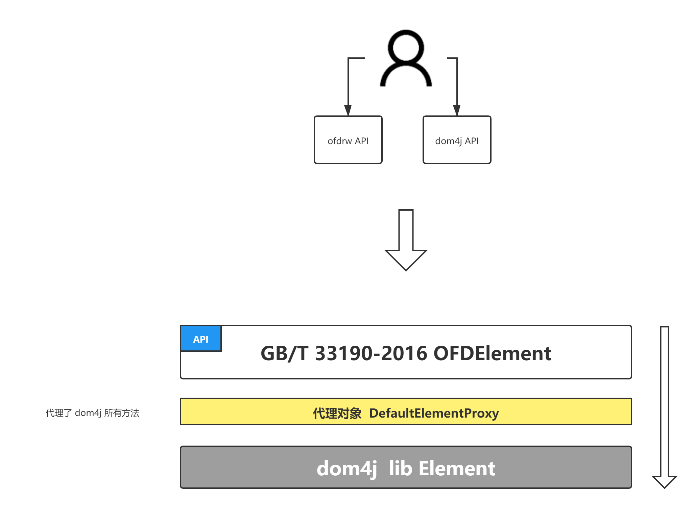

# OFD R&W Core 核心模块

该模块是操作OFD的基础，它实现了《GBT_33190-2016_电子文件存储与交换格式版式文档》中提及的所有OFD以及相关的数据结构和方法。

更多请看源码，代码包含了标准中所有注释和说明文字。

OFD数据结构采用了代理模式，代理抽象了 dom4j库的dom对象，并对基础对象进行扩展。

进而用户可以使用OFDRW提供的API和 dom4j提供的API操作OFD数据结构。

逻辑如下：

