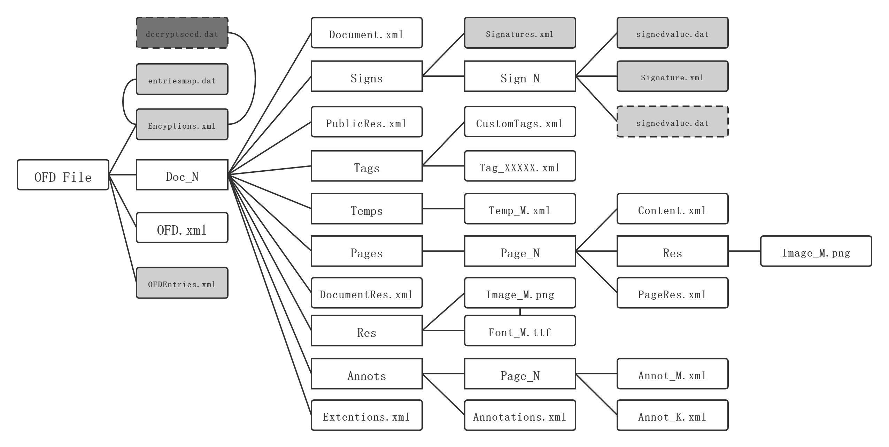

# OFD Reader & Writer 密码应用

在《GM/T 0099-2020 开放板式文档密码应用技术规范》中主要介绍了OFD的三种密码应用协议：

- OFD签名协议
- OFD加密协议：口令、证书
- OFD完整性保护协议

在《GM/T 0099-2020》文档容器为了适应上述三个协议增加定义部分结构，如下：

相较于《GBT/33190-2016》《GM/T 0099-2020》中增加了：

容器类：

- `/Doc_N/Tags/`：于存放自定义的标签。
- `/Doc_N/Temps/`：用于存放页面模板文件。
- `/Doc_N/Annots/Pages_N/`：用于存放页面注释。

文件对象：

- `/decryptseed.dat`：【XML】加密密钥描述文件，存储了方案、算法和多人、多角色、多密码或证书等关键解密信息。
- `/entriesmap.dat`：【二进制】加密后的明密文映射表，存放了明文和密文文件路径映射关系。
- `/Encryptions.xml`：解密入口文件，主要包含了2部分信息， 一部分为加密概要信息，另一部分为密钥描述文件和明文映射表的位置。
- `/OFDEntries.xml`：完整性描述文件，描述支撑文件完整性的包内文件列表、签名方案、保存的签名值等内容。
- `/Doc_N/Extentions.xml`：（标准中没有明确提及作用，推测为扩展使用）

## 章节目录

各协议详情如下：

- [《OFD签名协议》](./doc/sign/README.md)
- [《OFD加密协议》](doc/enc/README.md)
- [《OFD完整性保护协议》](./doc/protect/README.md)
