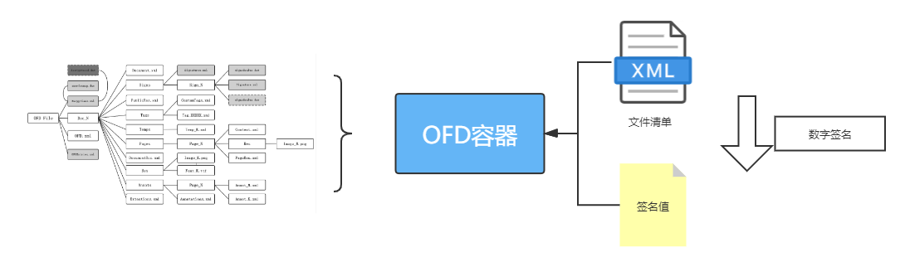

# OFD完整性保护协议

## 协议概述

由于OFD是一个ZIP文件，从技术机制上可以包含各种文件。如果一个OFD文件包内的文件， 其在按照“OFD.xml”“Encryptions.xml”及其衍生文件充分遍历后，仍未被任何其他文件引用， 这就属于“夹带文件”。 ——《GM/T
0099-2020》 附录D 总体说明

OFD的完整性保护信息使用XML文件描述。完整性保护文件中应记录OFD文件内与文件内容相关的 所有包内文件。 应对完整性保护文件实现 **带有时间戳的数字签名**。——《GM/T 0099-2020》7.4.2 数据格式要求

> 签名值应符合“GB/T 35275”标准

完整性保护协议：

1. 把所有OFD内容所有相关联的文件，放入一个“清单”，也就是 完整性保护文件。
2. 对 完整性保护文件 实行 带有时间戳的数字签名。
3. 把 完整性保护文件 和 数字签名 放入OFD包内，打包。



验证：

1. 验证签名是否正确
2. 验证时就是遍历所有文件，如果有文件不在 完整性保护文件 列表中，认为是夹带。

## 快速开始

### 国密完整性保护

进行OFD的完整性保护你需要进行下面步骤：

1. 准备进行完整性保护签名者的 **私钥** 和 **签名证书**。
2. 创建完整性保护对象`OFDIntegrity`。
3. 创建签名实现容器。
4. 执行完整性保护。
5. 结束，关闭清空工作过程中的临时文件！

下面以没有加密的SM2私钥和数字证书为例，演示该过程：

```java
class HelloWorld {
    public static void main(String[] args) {
        Path src = Paths.get("src/test/resources/hello.ofd");
        Path out = Paths.get("target/hello-integrity.ofd");

        Path certPemFile = Paths.get("src/test/resources", "sign_cert.pem");
        Path keyPemFile = Paths.get("src/test/resources", "sign_key.pem");

        // 1. 准备 签名私钥 和 签名证书
        final PrivateKey privateKey = PEMLoader.loadPrivateKey(keyPemFile);
        final Certificate certificate = PEMLoader.loadCert(certPemFile);

        // 2. 创建完整性保护对象
        try (OFDIntegrity ofdIntegrity = new OFDIntegrity(src, out)) {
            // 3. 创建签名实现容器
            GMProtectSigner gmSigner = new GMProtectSigner(privateKey, certificate);
            // 4. 执行完整性保护
            ofdIntegrity.protect(gmSigner);
        }
        // 5. 关闭对象，清除临时文件 try()
        System.out.println(">> " + out.toAbsolutePath());
    }
}
```

- 见源码 [OFDIntegrityTest.java](../../src/test/java/org/ofdrw/crypto/integrity/OFDIntegrityTest.java)

为了便于测试在 [ofdrw-crypto/src/test/resources](../../src/test/resources/) 准备了一对测试用的PEM（PKCS#8）证书和密钥

- [SM2证书 sign_cert.pem](../../src/test/resources/sign_cert.pem)
- [SM2密钥 sign_key.pem](../../src/test/resources/sign_key.pem)

> 示例中采用 GMProtectSigner 实现摘要和签名的计算过程，它实现了 `ProtectSigner` 接口
>
> 如果对签名和摘要计算有特殊需求请通过实现 [ProtectSigner](../../src/main/java/org/ofdrw/crypto/integrity/ProtectSigner.java) 接口 来实现个性化定制签名。

### 完整性验证

进行OFD的完整性验证你需要进行下面步骤：

1. 创建OFD完整性验证器。
2. 创建用于验证签名值的验证器。
3. 执行完整性验证，获取验证结果。

```java
class HelloWorld {
    public static void main(String[] args) {
        Path in = Paths.get("src/test/resources/hello-integrity.ofd");
        // 1. 创建OFD完整性验证器。
        OFDIntegrityVerifier ofdIntegrityVerifier = new OFDIntegrityVerifier();
        // 2. 创建用于验证签名值的验证器。
        GMProtectVerifier gmProtectVerifier = new GMProtectVerifier();
        // 3. 执行完整性验证，获取验证结果。
        final boolean integrity = ofdIntegrityVerifier.integrity(in, gmProtectVerifier);
        System.out.println(">> OFD完整性校验: " + integrity);
    }
}
```

- 见源码 [OFDIntegrityVerifierTest.java](../../src/test/java/org/ofdrw/crypto/integrity/OFDIntegrityVerifierTest.java)

> 示例中采用 GMProtectVerifier 实现摘要和签名的，它实现了 `ProtectVerifier` 接口
>
> 如果对签名和摘要计算有特殊需求请通过实现 [ProtectVerifier](../../src/main/java/org/ofdrw/crypto/integrity/ProtectVerifier.java) 接口 来实现个性化定制签名验证。


