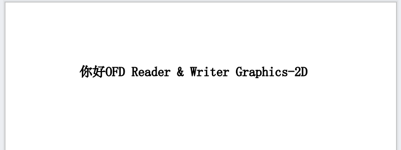

# OFD Reader And Writer Graphics 2D 图形绘制API

OFDRW Graphics 2D实现了JDK中`AWT Graphics2D`接口，它提供了一套全新的API用于生成OFD文档。

OFDRW已经有Canvas元素了为什么要实现`Graphics2D`接口？

- 借助标准Graphics2D接口可以复用现有的各类格式文件转换库的转换代码，实现其他类型文件或格式转换为OFD文件，如PDF转换OFD。

>
致谢：[jfree/skijagraphics2d](https://github.com/jfree/skijagraphics2d)、[apache.org/batik](https://xmlgraphics.apache.org/batik/)
它们为ofdrw-graphics2d模块的开发提供非常多的灵感，非常感谢。

## Quick Start

引入依赖

```xml

<dependency>
    <groupId>org.ofdrw</groupId>
    <artifactId>ofdrw-graphics2d</artifactId>
    <version>2.0.5</version>
</dependency>
```

> - 若您没有采用Maven管理项目，请参阅项目中`pom.xml`文件中的依赖，手动解决三方依赖包问题。


ofdrw-graphics2d模块使用流程如下：

1. 创建OFD文档对象。
2. 创建页面。
3. 使用Graphics 2D接口生成页面内容。
4. 关闭文档。

```java
package org.ofdrw.graphics2d;

import java.awt.*;
import java.io.IOException;
import java.nio.file.Path;
import java.nio.file.Paths;

public class HelloWorld {

    public static void main(String[] args) throws IOException {
        final Path dst = Paths.get("HelloWorld.ofd");
        try (OFDGraphicsDocument doc = new OFDGraphicsDocument(dst)) {
            OFDPageGraphics2D g = doc.newPage(null);
            g.setColor(Color.BLACK);
            g.setFont(new Font("宋体", Font.PLAIN, 7));
            g.drawString("你好OFD Reader & Writer Graphics-2D", 40, 40);
        }
        System.out.println(">> " + dst.toAbsolutePath());
    }
}
```

效果如下：



## API使用说明

OFDRW-Graphics2d模块主要由以下构成：

- `OFDGraphicsDocument` 负责创建和打包文档，并且提供资源管理器的功能。
- `OFDPageGraphics2D` 实现了`AWT Graphics2D`接口，用于绘制图形图像。

### OFDGraphicsDocument 图形OFD文档

`org.ofdrw.graphics2d.OFDGraphicsDocument`实现了OFD文档的创建以及打包，并提供一部分资源管理器的功能实现。

您可以通过下面构造器通过提供生成文件的路径来实现`OFDGraphicsDocument`创建。

```java
OFDGraphicsDocument doc=new OFDGraphicsDocument(dst);
```

在获得了`OFDGraphicsDocument`对象之后您就可以往刚才创建的OFD文件中添加页面了，请使用下面接口`newPage`创建页面

通过Box

```
CT_PageArea pSize=new CT_PageArea()
        .setPhysicalBox(0,0,210d,297d)
        .setApplicationBox(0,0,210d,297d);

OFDPageGraphics2D g=doc.newPage(pSize);
```

> 若`newPage`参数为`null`，那么创建的页面将使用文档默认页面大小，一般为 A4 (210 x 297 mm) 大小。

或通过手动设定页面长、宽的方式创建页面：

```
OFDPageGraphics2D g = doc.newPage(210d,297d);
```

通过`newPage` 您可以得到一个页面的`OFDPageGraphics2D`对象，该对象实现了Graphics2D接口，接下来您就可以使用标准的Graphics2D接口绘制内容了。

除了创建页面之外`OFDGraphicsDocument`还提供部分资源管理功能：

| 函数原型                                         | 作用              |
|:---------------------------------------------|:----------------|
| `ST_ID addResImg(Image img)`                 | 向文档中添加图片资源。     |
| `ST_ID addDrawParam(CT_DrawParam drawParam)` | 向文档中绘制参数对象。     |
| `ST_ID newID()`                              | 产生下一个文档中对象的ID号。 |

### OFDPageGraphics2D OFD页面2D图形

`org.ofdrw.graphics2d.OFDPageGraphics2D`通过`OFDGraphicsDocument`对象创建，
`OFDPageGraphics2D`实现了`AWT Graphics2D`接口，您可以采用兼容Graphics2D的API在生成OFD内容。

> 注意：`OFDPageGraphics2D`是将绘制内容以矢量数据的方式进行绘制，该过程会丢失一些文档特性，如文字由于转换成了矢量图形数据所以可能无法复制等。

基本上您可以把`OFDPageGraphics2D`完全当做`java.awt.Graphics2D`
来使用，所以您可以阅读由 [Oracle 提供的JDK 1.8 Graphics2D API文档](https://docs.oracle.com/javase/8/docs/api/java/awt/Graphics2D.html)
来了解如何使用API。

下面列举常用的`Graphics2D`系列API

| 函数原型                                                                                        | 作用                                |
|:--------------------------------------------------------------------------------------------|:----------------------------------|
| `Graphics create()`                                                                         | 以当前的绘图环境创建新的绘图上下文，类似于Canvas的Save。 |
| `void dispose()`                                                                            | 销毁绘制上下文对象。                        |
| `void drawString(String str, float x, float y)`                                             | 绘制文字。                             |
| `boolean drawImage(Image img, int x, int y, int width, int height, ImageObserver observer)` | 在指定矩形区域内绘制图片。                     |
| `void fill(Shape s)`                                                                        | 填充图形区域。                           |
| `void setPaint(Paint paint)`                                                                | 设置画笔信息，如颜色、渐变等。                   |
| `void setStroke(Stroke s)`                                                                  | 设置描边属性，如粗细、虚线样式。                  |
| `void setFont(Font font)`                                                                   | 设置字体信息，包括字号、样式等。                  |
| `void setClip(Shape clip)`                                                                  | 设置裁剪区域。                           |
| `void clip(Shape s)`                                                                        | 追加自定义裁剪区域。                        |
| `void drawLine(int x1, int y1, int x2, int y2)`                                             | 画线。                               |
| `void fillRect(int x, int y, int width, int height)`                                        | 填充矩形区域。                           |
| `void drawRect(int x, int y, int width, int height)`                                        | 描边矩形区域。                           |
| `void drawOval(int x, int y, int width, int height)`                                        | 描边椭圆。                             |
| `void fillOval(int x, int y, int width, int height)`                                        | 填充椭圆。                             |
| `void drawArc(int x, int y, int width, int height, int startAngle, int arcAngle)`           | 描边圆弧。                             |
| `void fillArc(int x, int y, int width, int height, int startAngle, int arcAngle)`           | 填充圆弧。                             |
| `void drawPolyline(int[] xPoints, int[] yPoints, int nPoints)`                              | 描边折线。                             |
| `void drawPolygon(int[] xPoints, int[] yPoints, int nPoints)`                               | 描边多边形。                            |
| `void fillPolygon(int[] xPoints, int[] yPoints, int nPoints)`                               | 填充多边形。                            |
| `void translate(double tx, double ty)`                                                      | 移动坐标原点。                           |
| `void rotate(double theta)`                                                                 | 旋转坐标。                             |
| `void scale(double sx, double sy) `                                                         | 缩放坐标。                             |
| `void shear(double shx, double shy)`                                                        | 切变坐标。                             |
| `void transform(AffineTransform tx)`                                                        | 在当前坐标系基础追加变换矩阵变换坐标系。              |
| `void setTransform(AffineTransform tx)`                                                     | 设置坐标系统的变换矩阵。                      |

您也可以参考已有测试用例来学习如何使用`Graphics2D API`：

- [OFDPageGraphics2DTest.java](src/test/java/org/ofdrw/graphics2d/OFDPageGraphics2DTest.java)

## 相关文献

有关于`java.awt.Graphics2D` 参考文献：

- [Oracle . Java 2D API Overview . https://docs.oracle.com/javase/8/docs/technotes/guides/2d/spec/j2d-intro.html](https://docs.oracle.com/javase/8/docs/technotes/guides/2d/spec/j2d-intro.html)
- [Oracle . The Java™ Tutorials Trail: 2D Graphics . https://docs.oracle.com/javase/tutorial/2d/index.html](https://docs.oracle.com/javase/tutorial/2d/index.html)
- [Oracle . Class Graphics2D API . https://docs.oracle.com/javase/8/docs/api/java/awt/Graphics2D.html](https://docs.oracle.com/javase/8/docs/api/java/awt/Graphics2D.html)

Graphics2D API测试用例参考：

- [http://www.java2s.com/Tutorial/Java/0261__2D-Graphics/Catalog0261__2D-Graphics.htm](http://www.java2s.com/Tutorial/Java/0261__2D-Graphics/Catalog0261__2D-Graphics.htm)

