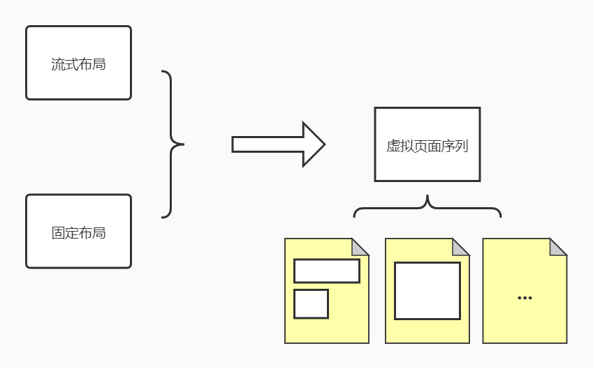

# OFD 布局

- [布局设计](./doc/README.md)

在OFD R&W中布局主要分为两种： 流式布局和固定布局（详见[布局设计](./doc/README.md)）

Layout库的工作就是把两种布局的样式翻译成 **虚拟页面**，也就是模型在页面中的排版定位。

虚拟页面: 

虚拟页面介于盒式模型和板式模型两种中间,虚拟页面内包含多个Div对象，这些对象都为绝对定位。
由于是绝对定位，因此不存在分页的情况。

## 布局引擎

根据布局方式的不同，布局引擎对于布局的处理方式也不一致，引擎设计如下：

### 固定布局

固定布局的处理方式相对来说比较简单。主要工作还是由调用者手动将一些列的固定布局的
Div元素放入手动创建的虚拟页面中。

### 流式布局

1. 对于流式布局首先，要将所有的元素输入到 **分段引擎** 当中进行初步的分段，然后得到段的队列。
2. 将分好的段队列输入到布局分析器中， **布局分析器** 将会处理输入的段，并生成虚拟页面。

其中布局分析器结构如下：

流式布局分析器主要作用有两点：

1. 确定Div元素在页面中的绝对定位，以及宽高。
2. 处理段的分页。

流式布局分析器最终的结果就是一系列定位和分页完成了的虚拟页面序列。