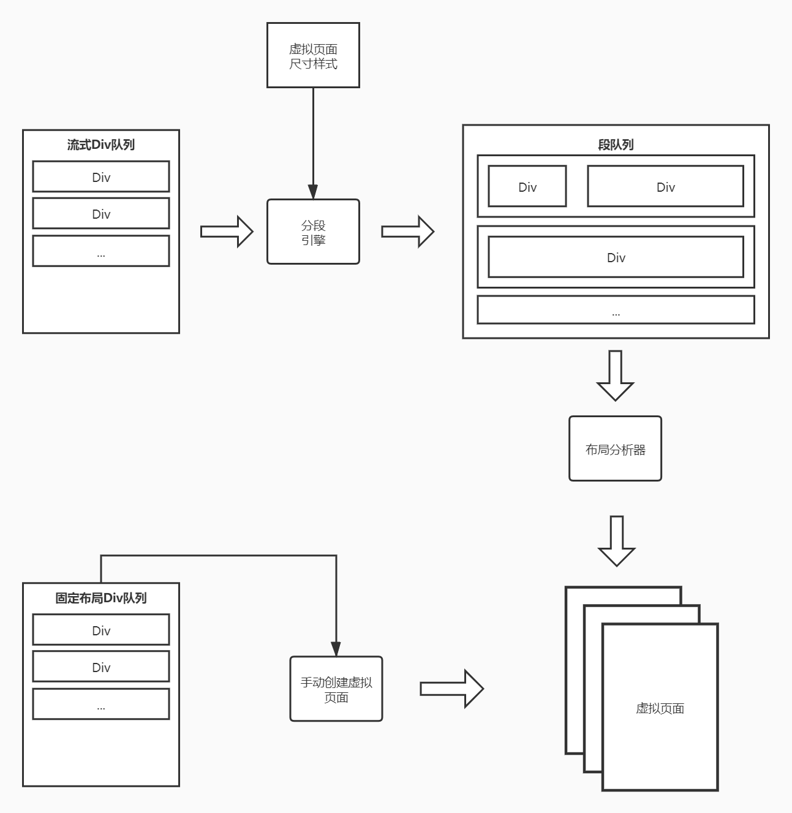

# OFD 布局

- [布局设计](doc/layout/README.md)

在OFD R&W中布局主要分为两种： 流式布局和固定布局（详见[布局设计](doc/layout/README.md)）

Layout库的工作就是把两种布局的样式翻译成 **虚拟页面**，也就是模型在页面中的排版定位。

虚拟页面: 

虚拟页面介于盒式模型和板式模型两种中间,虚拟页面内包含多个Div对象，这些对象都为绝对定位。
由于是绝对定位，因此不存在分页的情况。

## 布局引擎

根据布局方式的不同，布局引擎对于布局的处理方式也不一致，引擎设计如下：

### 固定布局

固定布局的处理方式相对来说比较简单。主要工作还是由调用者手动将一些列的固定布局的
Div元素放入手动创建的虚拟页面中。

### 流式布局

1. 对于流式布局首先，要将所有的元素输入到 **分段引擎** 当中进行初步的分段，然后得到段的队列。
2. 将分好的段队列输入到布局分析器中， **布局分析器** 将会处理输入的段，并生成虚拟页面。

其中布局分析器结构如下：

流式布局分析器主要作用有两点：

1. 确定Div元素在页面中的绝对定位，以及宽高。
2. 处理段的分页。

流式布局分析器最终的结果就是一系列定位和分页完成了的虚拟页面序列。

### 文档构建

#### 如何构建一份文档?

> 如何把大象放入冰箱?

1. 打开文档。
2. 放入内容。
3. 关闭文档。

对于使用者只需要通过 OFD R&W 提供的API创建一份文档，然后根据布局方式以
不同的API向文档中加入内容（流式文档就往文档中加入采用流式布局元素，
固定布局就往虚拟页面中加入固定布局内容，然后将虚拟页面加入文档），
最后在调用API关闭文档，这样一个OFD文件就产生了。

#### 文件构建原理

通过上面的了解可以知道 流式布局最终也会通过某些方式变换为虚拟页面，
虚拟页面是只是一个逻辑上页面并非真实页面。
所以OFD R&W 需要使用 **虚拟页面解析器** 来解析虚拟页面。

1. 虚拟页面进入解析器，解析器中持有OFD虚拟容器的上下文。
2. 解析虚拟页面得到OFD页面对象，已经一些相关的资源。
3. 页面中包含的资源可能存在两种情况：页面资源（图片等）、公共资源（如字体）。
4. 虚拟页面解析器将会把这些资源放置到OFD容器中的制定位置。
5. 在关闭文档时打包OFD容器。