# OFD 布局设计文档

## 原始OFD结构分析

文档主要构成如下：

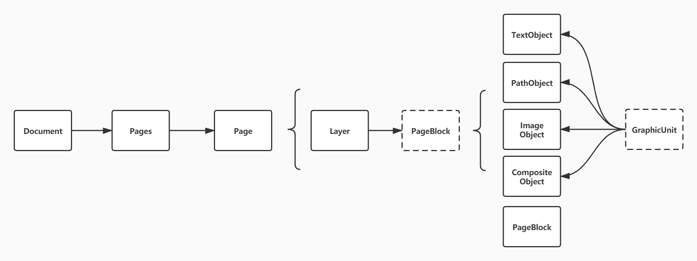

- *Document*: 定义了一个文档，包括文档内容、权限、文档数据等。
- *Pages*： 定义了一系列的页面，包括页面的顺序、页面描述文件所在的位置，相当于我们书本中书签一样的作用。
- *Page*： 定义一页页面，包括页面的大小，页面含有的内容。
- *Layer*: 页面中的内容之一，用于容纳页面中不同图层的内容。
- *PageBlock*: 页面中实际的元素的父类。
- *GraphicUnit*： 定义了页面元素一些基本表现。


### 页面（Page）

页面边界如下： (来自于《GBT_33190-2016_电子文件存储与交换格式版式文档.pdf》 图 8)

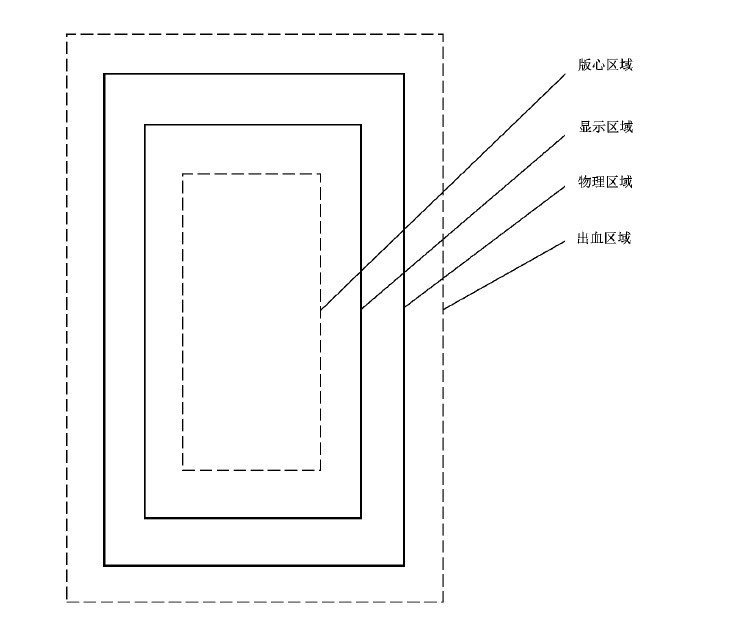

- 物理区域: 页面物理区域，左上角的坐标为页面空间坐标系的原点。
- 显示区域: 页面内容实际显示或打印输出的区域，位于物理区域内，包含页眉、页脚、版心等内容。
- 版心区域： 文件的正文区域，位于显示区域内。左上角坐标决定了在显示区域内的位置。
- 出血区域: 超出设备性能限制的额外出血区域，位于物理区域外。不出现时默认值为物理区域。

页面的层次结构可以通过在Document中定义并描述，也可以在每个页面中独立出现，当页面中不含页面结构层次描述时，默认从使用Document中的页面层次结构。

页面可以用下面结构进行理解:

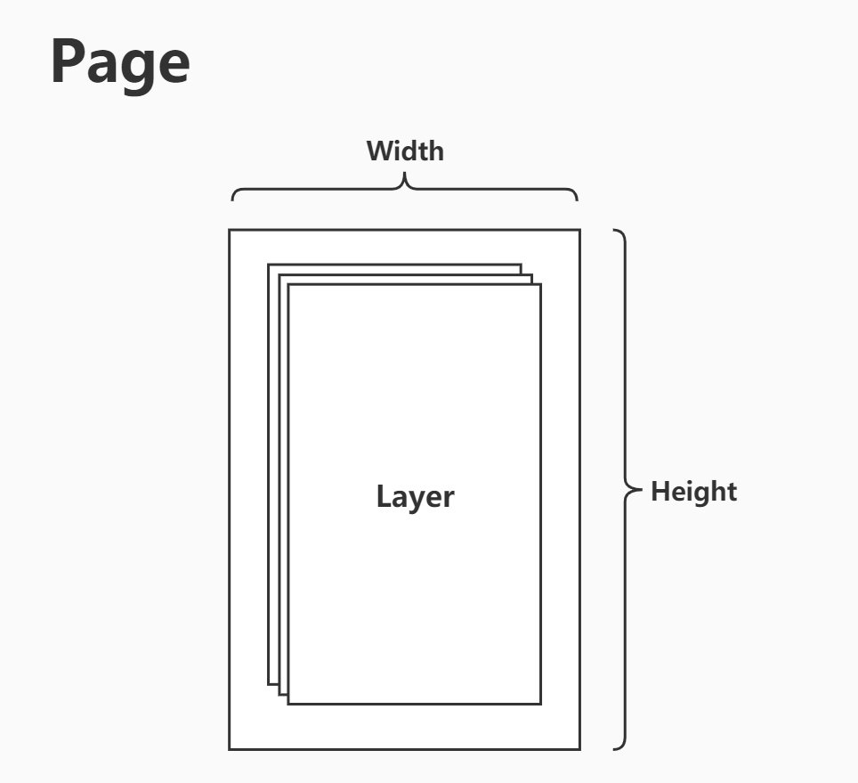

页面主要功能:

1. 页面的大小。
2. 容纳图层。

页面本身是不容纳实际的图元，页面只是一个容器了一系列的图层，在图层中容纳各个图元。页面按照一定的图层顺序，依次渲染。

我们所有看的一个OFD页面都是页面中一系列图层按照一定顺序，渲染得到。

### 图层（Layer）

图层处于页面中用于容纳图形图像元素，也就是图元。

阅读器来解析文档时，会根据下面图层顺序进行页面的渲染。

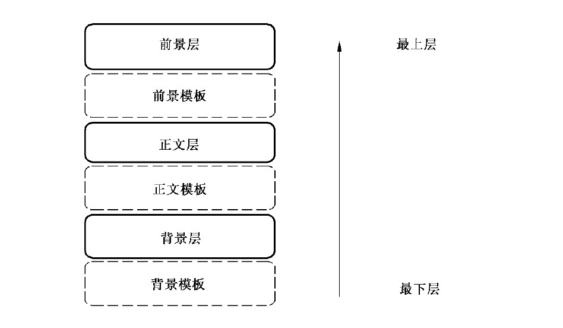

渲染时，自下而上，依次渲染。位于上层的图层可以覆盖位于它所出图层下方的图层内容。

### 图元（GraphicUnit）

图元是OFD中页面上呈现内容的最基本单元，所有页面显示内容，包括文字、图形、图像等，都属于图元，或是图元对象的组合。

图元在图层中如下所示：

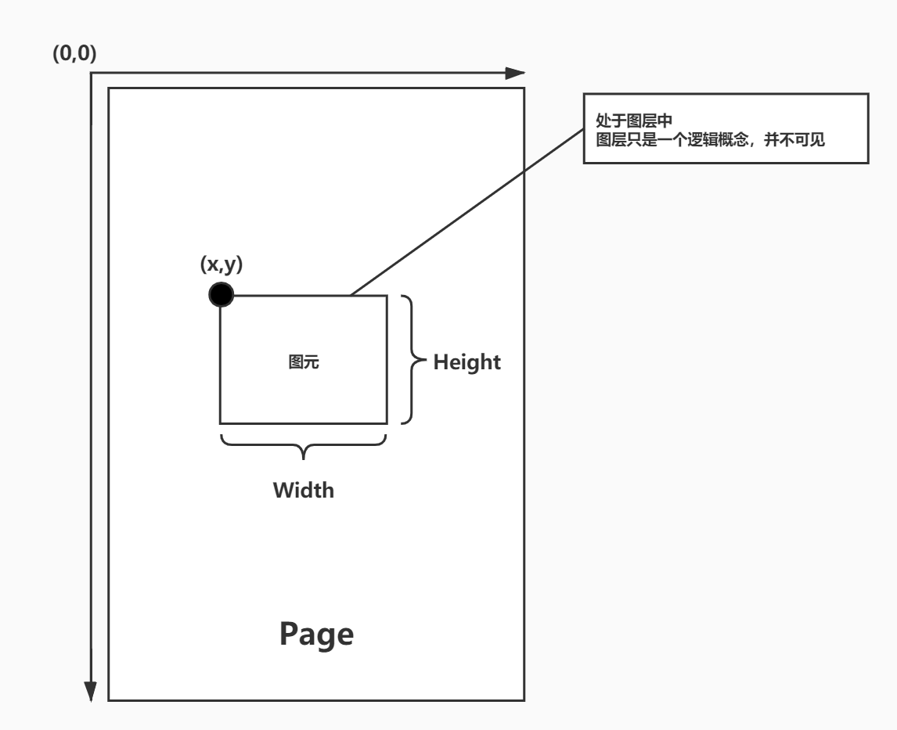

> 图层本身是只是一个逻辑概念，是不可见的，可以把它想象成一个与页面等大且透明的层。

图元主要功能是定义元素的位置，以及大小。它还可以通过变换矩阵对元素本身就进行变换，通过裁减区域对元素进行裁减。

## 布局分析

根据不同的方式，图元在页面中的布局方式可分为下面2种：

1. 通过固定坐标和大小确定图元在页面中位置的 **固定布局**。
2. 位置通过一定的规则计算得到，图元大小根据内容而变化或手动指定的方式得到的 **流式布局**。


图元定义了内容的在页面中的位置（坐标）和大小（宽高），但是无法进行更加细致的调整和布局。

在参考了HTML的盒式模型后，OFD R&W 也将采取盒式模型进行布局，而图元没有这样的能力，所以
此处采取抽象出一个盒式模型对象Div，该对象在最终通过渲染引擎的分析和调整之后，采用图元的
方式显示内容。

### 盒式模型

参考HTML的盒式模型结构如下：

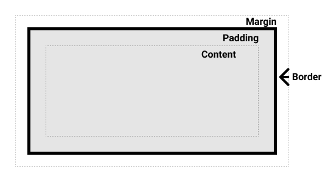

- Content box: 这个区域是用来显示内容，大小可以通过设置 width 和 height.
- Padding box: 包围在内容区域外部的空白区域； 大小通过 padding 相关属性设置。
- Border box: 边框盒包裹内容和内边距。大小通过 border 相关属性设置。
- Margin box: 这是最外面的区域，是盒子和其他元素之间的空白区域。大小通过 margin 相关属性设置。


> 以上均出自于 [The_box_model](https://developer.mozilla.org/zh-CN/docs/Learn/CSS/Building_blocks/The_box_model)


在OFD R&W 中默认情况设置`Margin`、`Border`和`Padding`都为0，仅在需要时进行设置。

> 注意： 与HTML不同OFD是板式文档，由于实现方式采用逻辑上的盒式模型，该模型仅
> 在渲染时候有效。在文档生成完成之后所有模型都会被渲染器翻译为图元，从图元中
> 仅能知道位置和大小，无法再还原回盒式模型。

盒式模型应有下面参数：

| 参数名 | 意义 |
| --- | --- |
| *Content width* | 内容宽度。 |
| *Content height* | 内容高度。 |
| *Padding* | 内边距。 |
| *Border* | 边框宽度。 |
| *Margin* | 外边距。 |
| *X* | 固定布局时表示盒式模型在页面中左上角X坐标。 |
| *Y* | 固定布局时表示盒式模型在页面中左上角Y坐标。 |
| *clear* | 对段的占用情况：none 表示共享，both 表示独占，默认值为none |
| *float* | 在段中的浮动方向：left、right、center。默认值为left |
| *left* | 相对于段的左边界距离。 |
| *right* | 相对于段的右边界距离。 |
| *top* | 相对于段的顶边的距离。 |
| *integrity* | 当渲染空间不足时可能会拆分元素，true为不拆分，false为拆分。默认值为false |

### 固定布局

固定布局即针对于某个确定页面空间的布局。固定布局和OFD的图元基本一致，但是为此处
通过逻辑实现了Padding、Border、Margin。

简单来说就是把盒式模型放置在某个固定大小的空间中，如下所示：

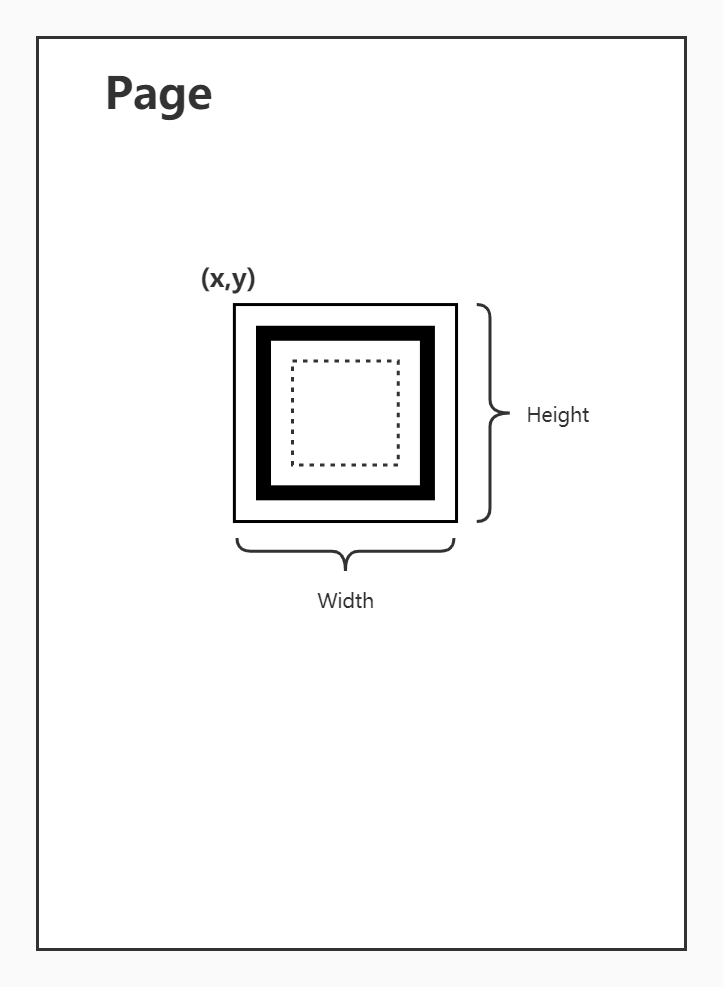

如果Padding、Border、Margin分别在上、右、下、左四个方向的值都一致，那么图元的宽度为：
```
Height = Content height + 2 * (Padding + Border + Margin)

Width = Content Width + 2 * (Padding + Border + Margin)
```

如果不一致则需要分别计算。


> 盒式模型最终会被翻译成图元并放置在页面中的图层内。

### 流式布局

流的定义： 在指定宽度下，高度为无穷大的区域。就好像水流一样永无止境。


在流式布局中没有页面的概念，所有Div均在流中，他们的位置由渲染引擎通过计算分析后得到。

那么如何划分和使用流?

这里将流在逻辑上按照一定规则计算分成很多的段（Segment）每个段具有一定的高度，如下所示：


由于段是逻辑上的概念，他是为盒式模型的定位而服务的，因此段应该由盒式模型来确定。
因此给出以下定义：

宽度与页面版心区域宽度相同，高度与段中最大盒式模型高度相同的区域，称为段。
在段中不允许出现宽度大于段宽度的盒式模型出现。


这里也就产生了两个问题：

1. 盒式模型如何在流中划分出段。
2. 盒式模型在段中如何定位。

#### 段与盒式模型

在段中的盒式模型可以分为下面两种情况:

1. *both*: 每个盒式模型独自占有一个段，段独占。
2. *none*: 多个盒式模型共享一个段，段共享（默认）。

通过Div中的`clear`属性控制。

##### 独占

在独占的情况下，段中可以有下面几种情况。

盒式模型占满整个段：

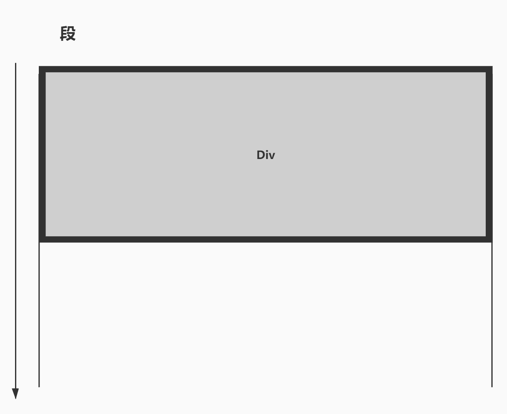

> 占满整个段的情况无论是段独占或是段共享都是一致的。

无法占满整个，整个段时应可以通过设置一定的属性来控制盒式模型在段中的位置。

根据控制方式的不同可分为：

1. 浮动位置。
2. 相对位置。

浮动位置


根据浮动的位置可以有三种浮动方式: 左（left）、右（right）、居中（center）。

通过Div中的`float`参数控制。

相对位置

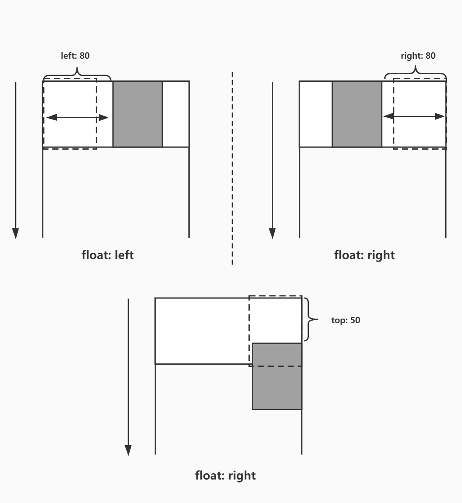


**相对定位的对象是元素原来占有位置的相对位置。只是看起是位置是那样，在布局时并不会考虑相对定位坐标。**

通过Div中的`left`和`right`参数控制，如果需要调整与段顶边的相对位置还可以使用`top`参数。

##### 共享

在共享的情况下，只要段中的剩余宽度足够容纳其他合适模型，就可以在同一个段
中放置多个合适模型，段的高度由段中最高的盒式模型决定。


与独占情况下的浮动位置一致，段中的合适模型定位方式有：浮动位置和相对位置，
特别的相对位置情况下相对的是同一个段中的前一个（也就是浮动方向的前一个）
如果没有前一个模型，则相对段的某条边（根据浮动方向决定）。
浮动方式默认为向左浮动。

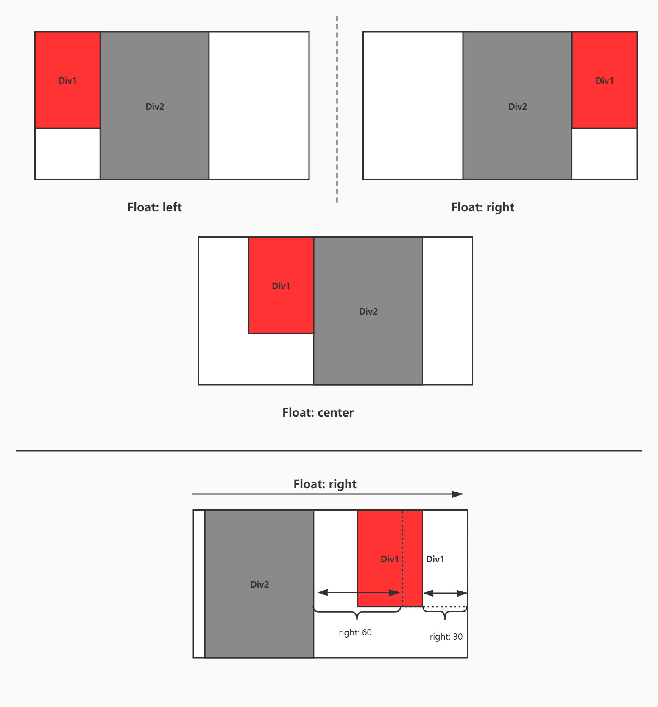

> 浮动模式的相对定位需要根据浮动方向设置同方向的相对位置。如浮动方向为right，
> 那么相对定位也应该是right。

### 流式布局策略

所有盒式模型按照顺序（放入文档中的时间顺序），根据浮动方式放入段中。

放入盒式模型时，根据段的剩余空间的宽度可能会出现下面几种情况：

- 盒式模型宽度大于段最大宽度，舍弃。
- 合适模型宽度小于等于段中的剩余空间宽度，放入。
- 合适模型宽度大于段中的剩余空间宽度且小于段最大宽度，结束该段，新起一段并放入。


#### 段的跨页

段内的不可分割元素，首先检查高度和宽度是否允许，如果允许则放入；
如果不允许则流转至下一段，如果段内还有其他元素，那么也同样流转至下一段,在新的一段中将会占有上一个段消耗的宽度。

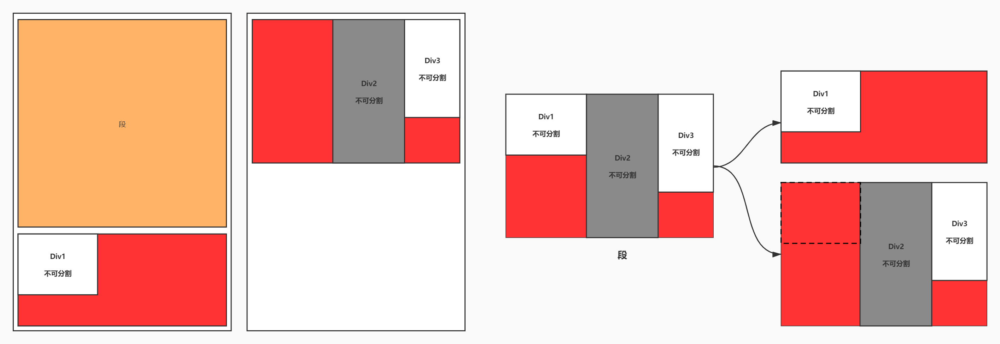

对于分割元素，首先将能放置的内容放置一部分，将剩余部分放置于同样元素的新对象和新的段中。
在新的段中的会保持分隔前段内的占位。

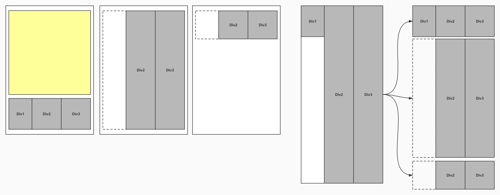


### 文字布局

文字排版规则是在行内放置竟可能多的文字，如果空间不足以放置，如果下方还有空间
那么将剩余文字转移到新启的一行内，规则如上；如果下方空间不足，则将剩余文字舍弃。

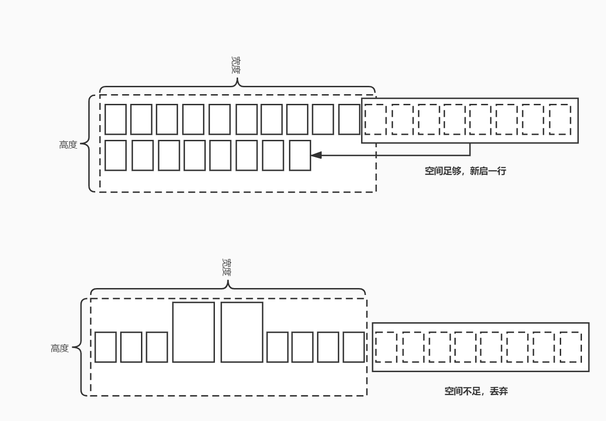

#### 文字大小测量规则

下面是官方在标准中提及的文字示例：

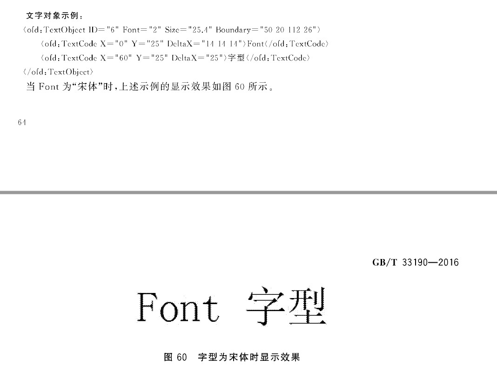

上方示例中显示了字体大小为25.4的情况下中文的英文字体文字间隔。

- 中文字体间隔为： 25
- 英文字体间隔为： 14

因此我们可以大胆的推断：

- 中文字体的文字间隔应该与字体大小相等。
- 英文字体的文字间隔应该是字体大小的一半（向上取整）。