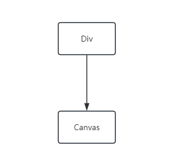
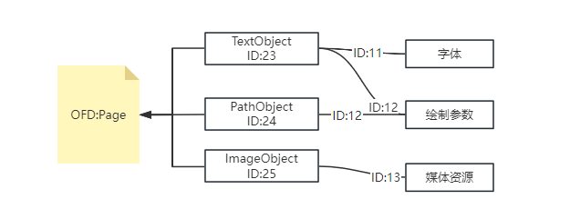
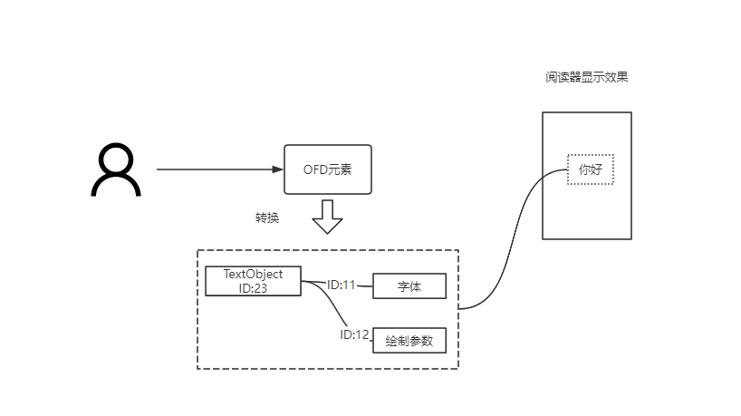
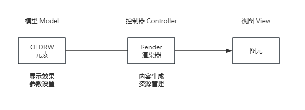
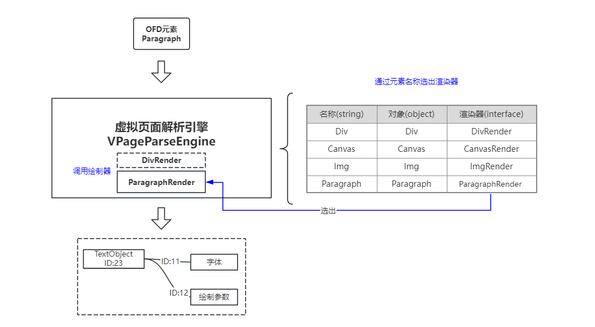

# OFDRW 扩展 自定义元素

OFDRW支持通过自定义元素可以封装较为复杂或重复的元素，简化OFD文档的生成过程。

目前OFDRW主要提供了两种方式来实现用户自定义元素，分别两种方式在文档操作的颗粒度上有所不同：

- 基于Canvas的扩展：适用于对绘制效果有较高定制要求的场景。
- 基于Div的扩展：适合于对文档结构有较高定制要求的场景。

若你需要使用OFDRW深入控制OFD文档的生成过程，你可能还需了解一些OFDRW元素的概念，以及如何使用OFDRW元素来生成OFD文档，详见后续章节 **OFDRW元素概论** 。

## 基于Canvas的扩展
本质上Canvas也是Div一种特殊的扩展，Canvas集成了Div的所有功能，同时提供了图形化的绘制接口（ctx），但是一定程度上隐藏了文档生成细节。

TODO: Canvas扩展步骤，以及示例代码。

## 基于Div的扩展

TODO: 扩展步骤，以及示例代码。

在详细讲解如何扩展之前，我们先来了解一下OFDRW元素的概念。

## OFDRW元素概论

为了让OFD页面上显示文字图形等元素，必须使用OFD中的对象描述这些图形图像，这些对象被称作图元（CT_GraphicUnit）常见的图元有：`TextObject`、`PathObject`、`ImageObject`等。

OFDRW元素是对OFD对象生成方法的封装，通过OFDRW元素可以简化OFD图元的创建过程，减少开发者对OFD对象的直接操作，
这样开发者便不需要关心OFD图元对象的ID、资源ID、虚拟容器等细节，更多关注于文档内容的生成。

通常一个OFDRW元素往往需要多个OFD图元来实现，从OFD文档本身来说OFDRW元素是一个高层次的抽象，而OFD图元是一个低层次的实现。

基于上述设计OFDRW设计时采用了 **模型-控制器-视图**(Model-Controller-View) 的设计模式，在OFDRW中它们分别代表：

- **模型**：OFDRW元素（**Div**），用于给用户提供API设置绘制效果的参数，包括Div元素以及由Div元素扩展的元素，例如Img、Canvas、Paragraph等元素。
- **控制器**：OFD图元生成器（**Render**），负责将OFDRW元素转换为OFD图元并处理对图元相关的资源管理（字体、图片、绘制参数等虚拟容器操作和资源管理），每个OFDRW元素都有一个对应的OFD图元生成器。
- **视图**：OFD对象（**CT_GraphicUnit**），即最终呈现可实效果的OFD中的图元对象，包括TextObject、PathObject、ImageObject等。

实际用户在操作OFDRW元素是可能还会接触到 虚拟页面、流式布局等概念，详见 [《OFD 布局设计文档》](../layout/README.md) 。

在OFDRW中，用户通过创建一个OFDRW元素，设置元素的属性，然后将元素添加到虚拟页面或文档中。
当文档关闭时，OFDRW会将虚拟页面中的OFDRW元素转换为OFD对象，也就是控制器驱动模型转换为视图的过程，该过程由 **虚拟页面解析引擎（VPageParseEngine）** 实现。

在虚拟页面解析引擎（VPageParseEngine）中，存储了每种OFDRW元素的 **Render** 对象，当 **VPageParseEngine** 得到一个OFDRW元素时，会根据元素的类型找到对应的 **Render** 对象，然后调用 **Render** 对象的 **render** 方法，将OFDRW元素转换为OFD对象。

注意由于所有OFDRW元素都是基于Div扩展得到，因此任何OFDRW元素转换为图元前总是会先调用Div的 **Render** 对象的 **render** 方法，然后再调用自身的 **render** 方法。

