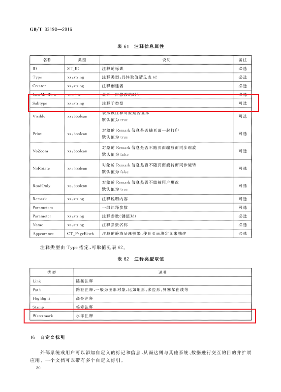
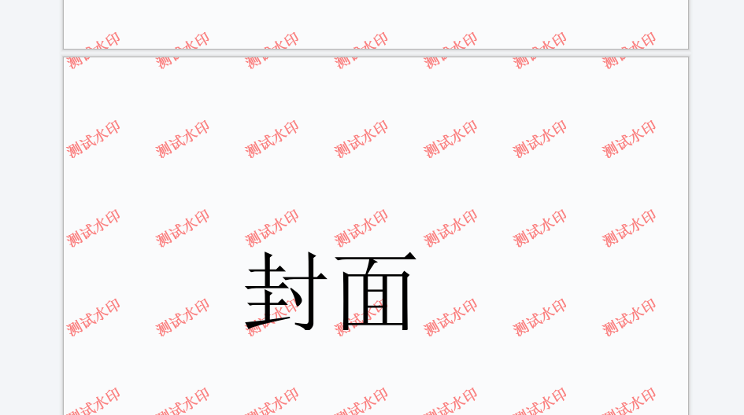

# OFDRW 添加水印 指南

## 1. 标准

按照OFD标准 GB/T 33190-2016 15.2 分页注释文件 的设计水印应该以一种特殊的注释类型存在于OFD页面中。



## 2. 基础用法

基于上述设计OFDRW提供一种便捷的水印设置方式 `org.ofdrw.layout.edit.Watermark`。
通过该对象可以设置水印区域、内容、文字效果、颜色、旋转角度、字体等属性，快速向 **整个文档** 添加水印。

您需要通过下面方式进行水印的添加：

1. 打开需要添加水印的文件。
2. 创建水印对象。
3. 设置水印的属性。
4. 添加水印到页面。
5. 关闭文件。

```java
public class Main{
    public static void main(String[] args)throws Exception {
        Path srcP = Paths.get("src.ofd");
        Path outP = Paths.get("watermarked.ofd");
        // 1. 打开需要添加水印的文件
        try (OFDReader reader = new OFDReader(srcP);
             OFDDoc ofdDoc = new OFDDoc(reader, outP)) {
            // 2. 创建水印对象
            Watermark watermark = new Watermark(ofdDoc.getPageLayout());
            // 3. 设置水印的属性
            watermark .setValue("测试水印")
                    .setFontName("宋体")
                    .setColor("#FF0000")
                    .setFontWeight("900")
                    .setAngle(330d)
                    .setFontSize(5d);
            // 4. 添加水印到页面
            ofdDoc.addWatermark(watermark);
        }
        // 5. 关闭文件 try-resource close
    }    
}
```

效果如下：




示例代码详见： [WatermarkTest.java](../../src/test/java/org/ofdrw/layout/cases/watermark/WatermarkTest.java)


## 3. 自定义水印

若您需要向指定页面添加水印，或者需要更加复杂的水印效果，那么`org.ofdrw.layout.edit.Watermark`就难以满足您的需求，这时您可以通过自定义注释对象实现水印。

自定义水印的添加步骤如下：

1. 打开需要添加水印的文件。
2. 创建注释对象，并且设置类型为水印。
3. 提供注释绘制器，并在绘制器内部实现水印的绘制逻辑。
4. 添加注释到页面。
5. 关闭文件。

```java
public class Main{
    public static void main(String[] args) {
        Path srcP = Paths.get("src/test/resources", "no_page_container.ofd");
        Path outP = Paths.get("target/AddWatermarkAnnot.ofd");
        
        // 1. 打开需要添加水印的文件
        try (OFDReader reader = new OFDReader(srcP);
             OFDDoc ofdDoc = new OFDDoc(reader, outP)) {

            Double width = ofdDoc.getPageLayout().getWidth();
            Double height = ofdDoc.getPageLayout().getHeight();
            
            // 2. 创建注释对象，并且设置类型为水印
            Annotation annotation = new Annotation(new ST_Box(0d, 0d, width, height), AnnotType.Watermark, ctx -> {
                // 3. 提供注释绘制器，并在绘制器内部实现水印的绘制逻辑
                ctx.font = "8mm 宋体";
                ctx.fillStyle = "rgba(170, 160, 165, 0.4)";
                for (int i = 0; i <= 8; i++) {
                    for (int j = 0; j <= 8; j++) {
                        ctx.save();
                        ctx.translate(22.4 * i, j * 50);
                        ctx.rotate(45);
                        ctx.fillText("保密资料", 10, 10);
                        ctx.restore();
                    }
                }
            });
            // 4. 添加注释到页面
            ofdDoc.addAnnotation(1, annotation);
        }
        // 5. 关闭文件 try-resource close
    }
}
```

效果如下：


示例代码详见： [WatermarkTest.java](../../src/test/java/org/ofdrw/layout/cases/watermark/WatermarkTest.java)


