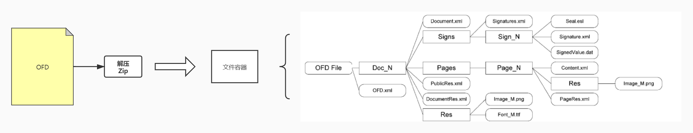
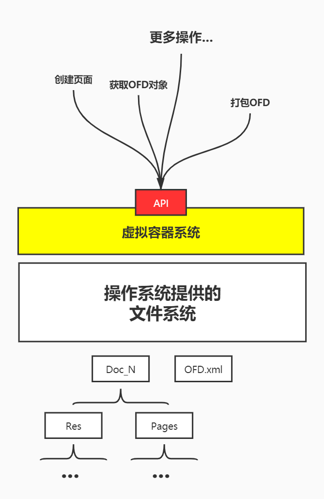

# OFD Reader And Writer 虚拟文件系统

OFD文件本身是一个通过ZIP算法压缩的压缩包，这个压缩包内包含了一个目录，目录中则是构成OFD各个部分内容。

在OFD解压之后也就是在操作的文件系统之上的一堆文件的集合，他们放在同一个目录中。

无论是构建OFD文档还是读取OFD文件都是有一个阶段OFD的呈现形式是在操作系统中的一个目录。

然后如果直接操作，文件系统的中文件必须要对OFD结构非常熟悉，还需要控制OFD对象的序列化和
反序列化，以及文件操作等。

因此OFD R&W 通过对操作系统上的文件系统的定制化包装构造出了一个OFD的虚拟容器系统，
通过虚拟容器系统提供的API，我们可以在不接触文件系统的情况，自由灵活的操作OFD文件内容和结构。

因此开发者不需要再面对文件系统自己手动进行操作，直接调用便利的API就可以完成各种文件操作和对象操作。

由于虚拟容器本身就是建立于文件系统上，因此虚拟容器还可以对OFD进行反序列化，将文件转化为对象
便于修改和更多的扩展操作。