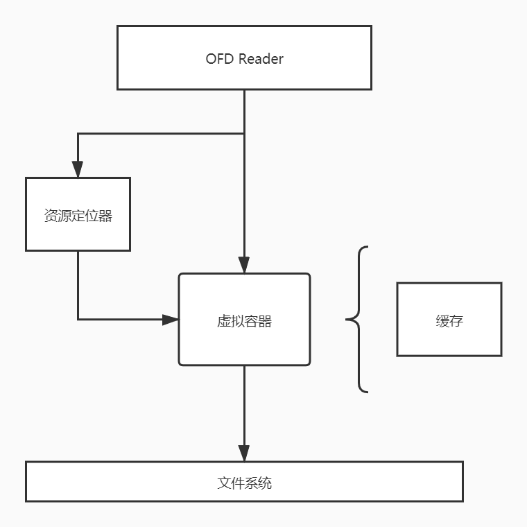

# OFD Reader

## 需求分析

什么地方会使用到Reader

- 编辑文档
- 签名文档

编辑： 解析文档结构构建虚拟容器，编辑内容，重新打包。

签名： 获取容器中相关文件然后计算Hash，计算签名/章，加入签章内容，重新打包。

> 签名/章过程中不需要完全解析文档，因此不需要构建文档虚拟容器，
> 只需要对文件的操作和相关的签名描述文件的操作。

需求

- 提供自由获取文档内的资源文件的能力。
- 反序列化回文档虚拟容器的能力。

## 资源定位器

在OFD中含有ST_Loc类型的对象，这种对象是一个路径地址，用于次用OFD虚拟容器中找到
需要的资源。

对该类路径的解析就需要使用到资源定位器。

资源定位核心功能是：

- 切换目录
- 获取资源

## 架构

解析器由两大组件构成

- 虚拟容器
- 资源定位

虚拟容器下层通过文件系统在支持，并且提供缓存方便反序列化。

资源定位器则是解析地址，从虚拟容器中获取资源同时缓存。