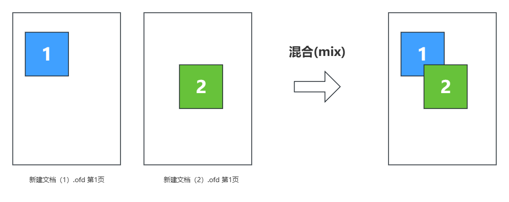

# OFD Reader & Writer 文档操作工具

**注意：文档操作将会导致文档结构内容变更，这将导致数字签名无效，请悉知！**

## 引入依赖

```xml
<dependency>
    <groupId>org.ofdrw</groupId>
    <artifactId>ofdrw-tool</artifactId>
    <version>2.3.6</version>
</dependency>
```

> - 若您没有采用Maven管理项目，请参阅项目中`pom.xml`文件中的依赖，手动解决三方依赖包问题。


## 页编辑

`OFDMerger` 提供了页面级别的多文档编辑功能，包括：

- 多文档合并
- 文档页裁剪
- 多文档页重组
- 多文档页混合

## 多文档合并

以常见用的多文档合并举例，调用流程如下：

1. 提供合并文件输出位置。
2. 提供待合并文件。
3. 创建合并对象`OFDMerger`。
4. 添加合并文档和页面（支持添加多个文档）。
5. 关闭合并对象，生成文档。

```java
public class Main {
    public static void main(String[] args) throws IOException {
        // 1. 提供合并文件输出位置。
        Path dst = Paths.get("dst.ofd");
        // 2. 提供待合并文件。
        Path d1Path = Paths.get("file1.ofd");
        Path d2Path = Paths.get("file2.ofd");
        Path d3Path = Paths.get("file3.ofd");
        // 3. 创建合并对象
        OFDMerger ofdMerger = new OFDMerger(dst);
        // 4. 添加合并文档和页面。
        ofdMerger.add(d1Path);
        ofdMerger.add(d2Path);
        
        // 5. 关闭合并对象，生成文档
        ofdMerger.close();
    }
}
```

为了更加灵活的合并文档，`OFDMerger#add`方法支持可选参数，指定需要合并的页面页码（从1开始），通过灵活使用该API可以实现多文档页面级别编辑功能。

测试用例详见：[OFDMergerTest.java](./src/test/java/org/ofdrw/tool/merge/OFDMergerTest.java)


### 裁剪

截取文档的部分页面生成新的文档。

```java
public class Main {
    public static void main(String[] args) {
        Path dst = Paths.get("dst.ofd");
        Path d1Path = Paths.get("file1.ofd");
        OFDMerger ofdMerger = new OFDMerger(dst);
        ofdMerger.add(d1Path, 1, 2);
        ofdMerger.close();
    }
}
```

测试用例详见：[OFDMergerTest.java](./src/test/java/org/ofdrw/tool/merge/OFDMergerTest.java)


### 多文档页重组

将多个文档中的页面合并到同一份文档中，并可以可用页面在新文档中的顺序。

```java
public class Main {
    public static void main(String[] args) {
        Path dst = Paths.get("dst.ofd");
        Path d1Path = Paths.get("file1.ofd");
        Path d2Path = Paths.get("file2.ofd");
        OFDMerger ofdMerger = new OFDMerger(dst);
        ofdMerger.add(d1Path, 1, 2);
        ofdMerger.add(d2Path, 1);
        ofdMerger.add(d1Path, 3);
        ofdMerger.close();
    }
}
```

测试用例详见：[OFDMergerTest.java](./src/test/java/org/ofdrw/tool/merge/OFDMergerTest.java)


### 多文档页混合(Mix)

将多个文档的页面合并到同一个页面中。



2页混合为1页，调用流程如下：

1. 创建合并对象`OFDMerger`。
2. 调用`addMix` 方法添加混合页面。
3. 关闭合并对象，生成文档。

```java
public class Main {
    public static void main(String[] args) {
        Path dst = Paths.get("dst.ofd");
        Path d1Path = Paths.get("file1.ofd");
        Path d2Path = Paths.get("file2.ofd");
        // 1. 创建合并对象
        OFDMerger ofdMerger = new OFDMerger(dst);
        // 2. 调用addMix方法添加混合页面
        ofdMerger.addMix(d1Path, 1, d2Path, 1);
        // 3. 关闭合并对象，生成文档
        ofdMerger.close();
    }
}
```


注意事项：

- 若多页面间大小不一致，以第一个页面的大小为准。
- 混合后同图层的页面，后面添加的页面内容将在上一个页面的上方。
- 混合内容包括页面内容、页面模板、注释。


如果需要混合2个以上的页面，可以构造一个页面数组，然后调用`addMix`方法。

```java
public class Main {
    public static void main(String[] args) {
        Path dst = Paths.get("dst.ofd");
        Path d1Path = Paths.get("file1.ofd");
        Path d2Path = Paths.get("file2.ofd");
        Path d3Path = Paths.get("file3.ofd");
        
        OFDMerger ofdMerger = new OFDMerger(dst);
        
        ArrayList<DocPage> boBeMixPages = new ArrayList<>();
        boBeMixPages.add(new DocPage(d1Path, 1));
        boBeMixPages.add(new DocPage(d2Path, 1));
        boBeMixPages.add(new DocPage(d3Path, 1));
        
        ofdMerger.addMix(boBeMixPages);
        ofdMerger.close();
    }
}
```

测试用例详见：[OFDMixTest.java](./src/test/java/org/ofdrw/tool/merge/OFDMixTest.java)
